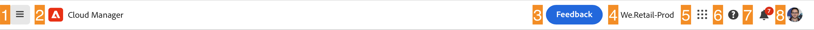
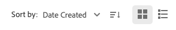
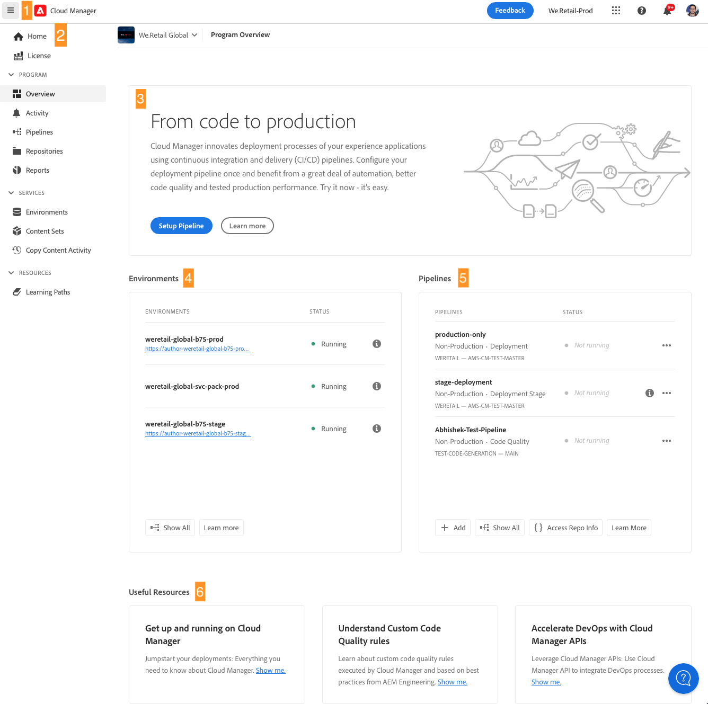
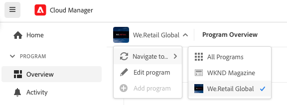
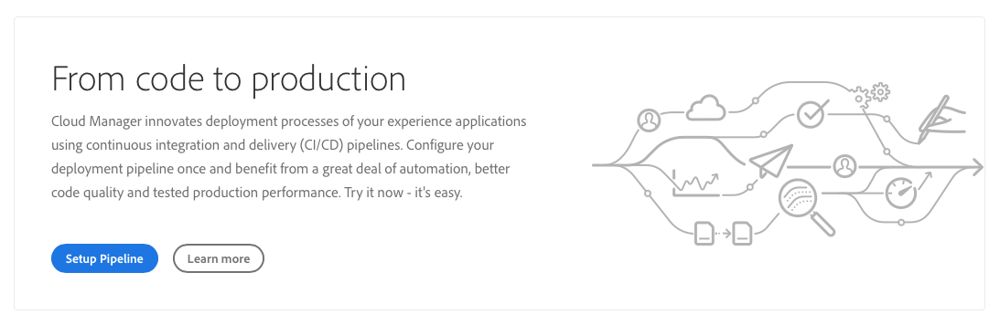

# Navigera i gränssnittet för molnhanteraren {#navigation}

Läs om hur Cloud Manager användargränssnitt är organiserat och hur du navigerar för att hantera program och miljöer.

Cloud Manager gränssnitt består huvudsakligen av två grafiska gränssnitt:

* [På konsolen Mina program](#my-programs-console) kan du visa och hantera alla program.
* [I fönstret Programöversikt](#program-overview) kan du se information om och hantera ett enskilt program.

## My Programs console {#my-programs-console}

När du loggar in på Cloud Manager på [my.cloudmanager.adobe.com](https://my.cloudmanager.adobe.com/) och väljer lämplig organisation, kommer du till konsolen **Mina program**.

Konsolen Mina program ger en översikt över alla program som du har tillgång till i den valda organisationen. Den består av flera delar.

1. [Verktygsfält](#toolbars-my-programs-toolbars) för organisationsval, aviseringar och kontoinställningar.
1. Flikar som gör att du kan växla den aktuella vyn av dina program.

   * Vyn **Hem** (standard) som väljer vyn **Mina program** med en översikt över alla program.
   * **Licens** som har åtkomst till License Dashboard. License Dashboard gäller endast *AEM as a Cloud Service-program* (AEMaaCS), inte AMS-program. Information om vilken typ av tjänst ditt program har (AEMaaCS eller AMS) finns i avsnittet [Programkort](#program-cards) i den här artikeln.
   * Flikarna stängs som standard och kan visas med hjälp av den nedrullningsbara menyn för hamburgikonen, som finns till vänster om [Cloud Manager-rubriken](#cloud-manager-header).

1. [Call-to-Actions och Statistics](#cta-statistics) för en översikt över din senaste aktivitet
1. [**Mina program** avsnitt](#my-programs-section) med en översikt över alla dina program
1. [Snabblänkar](#quick-links) gör det enkelt att komma åt relaterade resurser

>[!TIP]
>
>Mer information om program finns i [Program och programtyper](/help/getting-started/program-setup.md).

### Verktygsfält {#my-programs-toolbars}

Det finns två verktygsfält ovanpå varandra.

#### Cloud Manager header {#cloud-manager-header}

Den första är Cloud Manager header. Sidhuvudet är beständigt när du navigerar i Cloud Manager. Det är en ankarpunkt som ger dig tillgång till inställningar och information som gäller för alla Cloud Manager-program.

1. Ikonen  till vänster om huvudet är en nedrullningsbar meny som ger åtkomst till flikar för specifika delar av ett enskilt program. Beroende på sammanhanget kan du även växla mellan licensinstrumentpanelen och konsolen **[Mina program](#my-programs-console)** .
   * License Dashboard gäller endast AEM as a Cloud Service-program, inte AMS-program.
   * Information om vilken typ av tjänst ditt program har (AMS eller AEMaaCS) finns i avsnittet [Programkort](#program-cards) i det här dokumentet.
1. Med Cloud Manager-knappen kommer du tillbaka till My Programs-konsolen i Cloud Manager oavsett var du befinner dig i Cloud Manager.
1. Klicka på **Feedback** om du vill lämna feedback till Adobe om Cloud Manager.
1. Organisationsväljaren visar organisationen som du är inloggad på (i det här exemplet Foundation Internal). Klicka för att växla till en annan organisation om din Adobe ID är kopplad till flera.
1. Genom att klicka på lösningväljaren kan du snabbt komma igång med andra Experience Cloud-lösningar.
1. Ikonen Hjälp ger snabb åtkomst till utbildningsresurser och supportresurser.
1. Aviseringsikonen är märkt med antalet för närvarande tilldelade ofullständiga [meddelanden](/help/using/notifications.md)
1. Välj den ikon som representerar användaren för att få åtkomst till dina användarinställningar. Om du inte väljer någon användarbild tilldelas ikonen slumpmässigt.

#### Verktygsfältet Program {#program-toolbar}

Verktygsfältet Program innehåller länkar för att växla mellan Cloud Manager-program och åtgärder som passar just det sammanhanget.

1. Programväljaren öppnas i en listruta där du snabbt kan välja andra program eller vidta sammanhangsberoende åtgärder som att skapa ett nytt program
1. Länken Komma igång ger dig tillgång till [dokumentationsresan för introduktion](https://experienceleague.adobe.com/en/docs/experience-manager-cloud-service/content/onboarding/journey/overview) så att du kan komma igång med Cloud Manager.
Startresan är utformad för Cloud Manager på Adobe Experience Manager as a Cloud Service (AEMaaCS) och inte för Cloud Manager på Adobe Managed Services (AMS). Många koncept är dock desamma.
1. Åtgärdsknappen innehåller sammanhangsberoende åtgärder som att skapa ett nytt program.

### Samtal och statistik {#cta-statistics}

Avsnittet om uppmaning till handling och statistik innehåller aggregerade data för din organisation, t.ex. om du har konfigurerat dina program, kan statistik över dina aktiviteter under de senaste 90 dagarna visa, inklusive:

* Antal [distributioner](/help/using/code-deployment.md)
* Antal [kodkvalitetsproblem](/help/using/code-quality-testing.md) som identifierats
* Antal byggen

Eller om du just har börjat konfigurera organisationen kan det finnas tips om nästa steg eller dokumentationsresurser.

### Mina program {#my-programs-section}

Huvudinnehållet i My Programs-konsolen är avsnittet **Mina program** som listar dina program som enskilda kort. Klicka på ett kort för att komma åt sidan **Programöversikt** för mer information om programmet.

>[!NOTE]
>
>Beroende på vilka behörigheter du har kanske du inte kan välja vissa program.

Använd följande sorteringsalternativ så att du bättre kan hitta det program du behöver:

* Sortera efter
   * Skapad den (standard)
   * Programnamn
   * Status
* Stigande (standard) / Fallande
* Stödrastervisning (standard)
* Listvy

#### Programkort {#program-cards}

Ett kort eller en rad i en tabell representerar alla program och ger en översikt över programmet och snabblänkar för att vidta åtgärder.

* Programavbildning (om den är konfigurerad)
* Programnamn
* Tjänsttyp:
   * **Experience Manager** för AMS-program
   * **Experience Manager Cloud** för [AEM as a Cloud Service-program](https://experienceleague.adobe.com/en/docs/experience-manager-cloud-service/content/implementing/home)
* Status
* Konfigurerade lösningar
* Skapad den

Informationsikonen ger dig även snabb åtkomst till ytterligare information om programmet (användbart i listvyn).

Ikonen , ger dig tillgång till ytterligare åtgärder som du kan vidta i programmet.

* Navigera till en viss [miljö](/help/using/managing-environments.md) i programmet
* Öppna [programöversikt](#program-overview)
* [Redigera programmet](/help/getting-started/program-setup.md)
* Visa övervakning

### Snabblänkar {#quick-links}

I avsnittet med snabblänkar får du tillgång till användbara, relaterade resurser.

## Fönstret Programöversikt {#program-overview}

Om du väljer ett program i konsolen [**Mina program**](#my-programs-console) kommer du till sidan **Programöversikt** .

Programöversikten ger dig tillgång till alla detaljer i ett Cloud Manager-program. Precis som My Programs-konsolen består den av flera delar.

1. [Verktygsfält](#program-overview-toolbar) om du snabbt vill gå tillbaka till konsolen **Mina program** och navigera i programmet.
1. [Tabbar](#program-tabs) om du vill växla mellan olika aspekter av programmet.
1. Ett [anrop till åtgärd](#cta) baserat på de senaste åtgärderna i programmet.
1. En [översikt över programmets miljöer](#environments).
1. En [översikt över programmets pipelines](#pipelines).
1. Länkar till [användbara resurser](#useful-resources).

### Verktygsfält {#program-overview-toolbar}

Verktygsfälten för programöversikten liknar verktygsfälten i [Min programkonsol](#my-programs-toolbars). Här illustreras bara skillnaderna.

#### Cloud Manager header {#cloud-manager-header-2}

Cloud Manager-sidhuvudet har en rullgardinsmeny med en hamburgare-ikon som automatiskt öppnas och visar de navigeringsbara flikarna i programöversikten.

Klicka på hamburgikonen för att dölja flikarna.

#### Verktygsfältet Program {#program-toolbar-2}

Verktygsfältet för program ger dig fortfarande möjlighet att snabbt växla till andra program, men ger dessutom tillgång till sammanhangsberoende åtgärder som att lägga till och redigera programmet.

Om du dessutom döljer flikarna med hjälp av hamburgikonen, kan verktygsfältet fortfarande visa den flik som du för tillfället är på.

### Programflikar {#program-tabs}

Varje program har flera alternativ och data kopplade till sig. Dessa data samlas in på flikar för att underlätta navigeringen i programmet. Flikarna ger dig tillgång till:

* Översikt - Programöversikt enligt beskrivningen i det aktuella dokumentet
* [Aktivitet](/help/using/managing-pipelines.md#activity) - Historiken för programmets pipeline-körningar
* [Pipelines](/help/using/managing-pipelines.md#pipelines) - Alla pipelines har konfigurerats för programmet
* [Databaser](/help/managing-code/managing-repositories.md) - Alla databaser har konfigurerats för programmet
* [Rapporter](/help/using/monitoring-environments.md#system-monitoring-overview) - Mätvärden som SLA-data
* [Miljö](/help/using/managing-environments.md) - Alla miljöer konfigurerade för programmet
* [Innehållsuppsättningar](/help/using/content-copy.md) - Innehållsuppsättningar som skapats för kopieringsändamål
* [Kopiera innehållsaktivitet](/help/using/content-copy.md) - aktiviteter för innehållskopiering
* Utbildningsvägar - ytterligare utbildningsresurser om Cloud Manager

Som standard visas fliken **Översikt** när du öppnar ett program. Den aktuella fliken markeras. Välj en annan flik om du vill visa information om den.

Använd hamburgikonen i [Cloud Manager-huvudet](#cloud-manager-header-2) för att dölja flikarna.

### Call-to-action {#cta}

Avsnittet&quot;call-to-action&quot; ger användbar information beroende på programmets status. För ett nytt program kan du se nästa steg som erbjuds och en påminnelse om ett publiceringsdatum, [som anges när programmet skapas](/help/getting-started/program-setup.md).

För ett live-program, status för den senaste distributionen med länkar för information och start av en ny distribution.

### Miljökort {#environments}

Kortet **Environment** ger dig en översikt över dina miljöer och länkar för snabba åtgärder.

Kortet **Environment** innehåller endast tre miljöer. Klicka på **Visa alla** om du vill visa alla miljöer i programmet.

Mer information om hur du hanterar miljöer finns i [Hantera miljöer](/help/using/managing-environments.md).

### Förloppskort {#pipelines}

Kortet **Pipelines** ger dig en översikt över dina pipelines och länkar för snabba åtgärder.

Kortet **Pipelines** innehåller endast tre pipelines. Klicka på **Visa alla** om du vill visa alla rörledningar för programmet.

Mer information om hur du hanterar dina pipelines finns i [Hantera pipelines](/help/using/managing-pipelines.md).

### Användbara resurser {#useful-resources}

Avsnittet **Användbara resurser** innehåller länkar till ytterligare utbildningsresurser för Cloud Manager.
