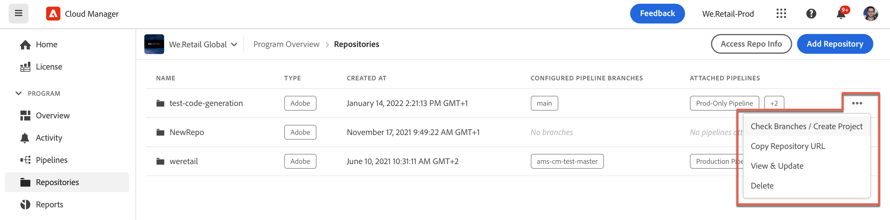

# Cloud Manager-databaser {#cloud-manager-repos}

Lär dig hur du skapar, visar och redigerar Git-databaser i Cloud Manager.

## Ökning {#overview}

Databaser används för att lagra och hantera projektkoden med Git. Alla program du skapar i Cloud Manager har en databas som hanteras av Adobe.

Du kan välja att skapa ytterligare Adobe-hanterade databaser och även lägga till egna privata databaser. Alla databaser som är associerade med ditt program kan visas i fönstret **Databaser**.

Databaser som har skapats i Cloud Manager är också tillgängliga när du lägger till eller redigerar pipelines. Mer information finns i [CI-CD Pipelines](/help/overview/ci-cd-pipelines.md).

Det finns en enda primär databas eller en gren för en given pipeline. Med stöd för [Git-undermodul](git-submodules.md) kan många sekundära grenar tas med vid byggtiden.

## Databasfönster {#repositories-window}

1. Logga in på Cloud Manager på [my.cloudmanager.adobe.com](https://my.cloudmanager.adobe.com/) och välj rätt organisation och program.

1. På sidan **Programöversikt** väljer du fliken **Databaser** för att växla till sidan **Databaser**.

1. Fönstret **Databaser** visar alla databaser som är associerade med ditt program.

   

Fönstret **Databaser** innehåller information om databaserna:

* Typ av databas.
   * **Adobe** anger databaser som hanteras av Adobe
   * **GitHub** anger privata GitHub-databaser som du hanterar
* När den skapades
* Pipelines som är associerade med databasen

Du kan markera databasen i fönstret och klicka på ellipsknappen för att vidta åtgärder för den valda databasen.

* **[Kontrollera grenar/Skapa projekt](#check-branches)** (endast tillgängligt för Adobe-databaser)
* **[Kopiera databas-URL](#copy-url)**
* **[Visa och uppdatera](#view-update)**
* **[Ta bort](#delete)**

## Lägg till databaser {#adding-repositories}

Klicka på knappen **Lägg till databas** i fönstret **Databaser** för att starta guiden **Lägg till databas**.

Cloud Manager har stöd för båda databaser som hanteras av Adobe (**Adobe-databas**) och dina egna självhanterade databaser (**Privat databas**). De obligatoriska fälten varierar beroende på vilken typ av databas du väljer att lägga till.

Se [Lägga till Adobe-databaser i Cloud Manager](adobe-repositories.md).
Se [Lägga till privata databaser i Cloud Manager](private-repositories.md).

>[!NOTE]
>
>En användare måste ha rollen **Distributionshanteraren** eller **Affärsägare** för att kunna lägga till en databas.
>
>Det finns en gräns på 300 databaser i alla program i ett visst företag eller i en IMS-organisation.

## Åtkomst till säljinformation {#repo-info}

När du visar dina databaser i fönstret **Databaser** kan du visa information om hur du kommer åt databaser som hanteras med Adobe genom att klicka på knappen **Åtkomstrepo-information** i verktygsfältet.

Fönstret **Databasinformation** öppnas med information. Mer information om hur du får åtkomst till databasinformation finns i [Åtkomst till databasinformation](accessing-repositories.md).

## Kontrollera grenar {#check-branches}

Åtgärden **Kontrollera grenar/Skapa projekt** utför två funktioner beroende på databasens tillstånd.

Om databasen är nyskapad skapar åtgärden ett exempelprojekt baserat på [den AEM projektarkitypen](https://experienceleague.adobe.com/en/docs/experience-manager-core-components/using/developing/archetype/overview).

Om exempelprojektet redan har skapats i databasen kontrolleras statusen för databasen och dess grenar, och sedan rapporteras om exempelprojektet redan finns.

## Kopiera databas-URL {#copy-url}

Åtgärden **Kopiera databas-URL** kopierar URL:en för den databas som är markerad i fönstret **Databaser** till Urklipp så att den kan användas någon annanstans.

## Visa och uppdatera {#view-update}

Åtgärden **Visa och uppdatera** öppnar dialogrutan **Uppdatera databas**. Med hjälp av den kan du visa förhandsgranskningen av **Namn** och **databas-URL** och uppdatera **Beskrivning** för databasen.

## Ta bort {#delete}

Åtgärden **Ta bort** tar bort databasen från ditt projekt. Det går inte att ta bort en databas om den är associerad med en pipeline.

När en databas tas bort i Cloud Manager markeras den som borttagen. Den är inte längre tillgänglig för användaren. Den bibehålls dock i systemet för att återskapas.

Om du försöker skapa en ny databas efter att ha tagit bort en databas med samma namn får du felmeddelandet `An error has occurred while trying to create repository. Contact your CSE or Adobe Support.`

Om du får det här felmeddelandet kontaktar du Adobe Support så att de kan hjälpa dig att byta namn på den borttagna databasen eller välja ett annat namn för den nya databasen.
