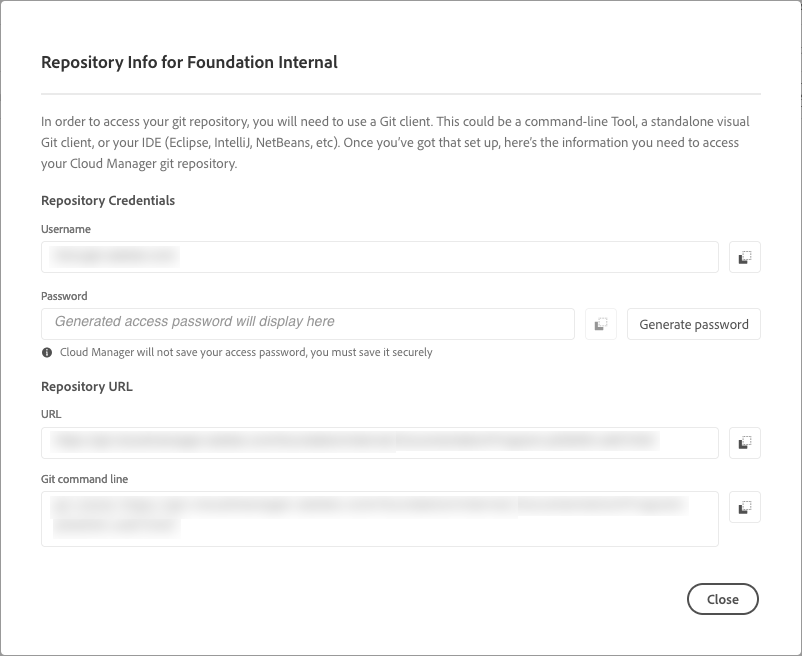

# Hantera databaser i Cloud Manager {#cloud-manager-repos}

Lär dig hur du visar, lägger till och tar bort en Git-databas i Cloud Manager.

## Ökning {#overview}

Databaser i Cloud Manager används för att lagra och hantera projektkoden med Git. För varje *program* som du lägger till skapas en Adobe-hanterad databas automatiskt.

Dessutom kan du skapa fler Adobe-hanterade databaser eller lägga till egna privata databaser. Alla databaser som är länkade till ditt program kan visas på sidan **Databaser**.

Databaser som skapas i Cloud Manager kan också väljas när du lägger till eller redigerar pipelines. Mer information om hur du konfigurerar pipelines finns i [CI-CD-pipelines](/help/overview/ci-cd-pipelines.md).

Varje pipeline är länkad till en primär databas eller gren. Med stöd för [Git-undermodul](/help/managing-code/git-submodules.md) kan flera sekundära grenar inkluderas under byggprocessen.

## Visa sidan Databaser {#repositories-window}

På sidan **Databaser** kan du visa information om den valda databasen. Denna information omfattar vilken typ av databas som används. Om databasen är markerad som **Adobe** anger den att den är en Adobe-hanterad databas. Om den är märkt som **GitHub** refererar den till en privat GitHub-databas som du hanterar. Dessutom innehåller sidan information om t.ex. när databasen skapades och om de rörledningar som är kopplade till den.

Om du vill vidta åtgärder för en vald databas kan du klicka på databasen och använda ikonen  för att öppna en nedrullningsbar meny. För databaser som hanteras av Adobe kan du **[kontrollera grenar/skapa projekt](#check-branches)**.

*Nedrullningsbar meny på sidan Databaser.*

Andra tillgängliga åtgärder på den nedrullningsbara menyn är bland annat **[Kopiera databas-URL](#copy-url)**, **[Visa och uppdatera](#view-update)** och **[Ta bort](#delete)** databasen.

**Så här visar du sidan Databaser:**

1. Logga in på Cloud Manager på [my.cloudmanager.adobe.com](https://my.cloudmanager.adobe.com/) och välj rätt organisation och program.

1. På sidan **Programöversikt** klickar du på  **Databaser** på sidomenyn.

1. På sidan **Databaser** visas alla databaser som är associerade med det valda programmet.

   
   *Sidan Databaser i Cloud Manager.*

## Lägga till en databas {#adding-repositories}

En användare måste ha rollen **Distributionshanteraren** eller **Affärsägare** för att kunna lägga till en databas.

Klicka på **Lägg till databas** på sidan **Databaser** i det övre högra hörnet.

*Dialogrutan Lägg till databas.*

Cloud Manager stöder två typer av databaser: Adobe-hanterade databaser (**Adobe-databas**) och självhanterade databaser (**Privat databas**). De obligatoriska fälten för konfiguration varierar beroende på vilken typ av databas du väljer att lägga till. Mer information finns i följande:

* [Lägga till Adobe-databaser i Cloud Manager](/help/managing-code/adobe-repositories.md)
* [Lägga till privata databaser i Cloud Manager](/help/managing-code/private-repositories.md)

Det finns en gräns på 300 databaser i alla program i ett visst företag eller i en IMS-organisation.

## Åtkomst till databasinformation {#repo-info}

När du visar dina databaser i fönstret **Databaser** kan du visa information om hur du får tillgång till de Adobe-hanterade databaserna programmatiskt genom att klicka på knappen **Åtkomstrepoinformation** i verktygsfältet.

Fönstret **Databasinformation** öppnas med information. Mer information om hur du får åtkomst till databasinformation finns i [Åtkomst till databasinformation](/help/managing-code/accessing-repositories.md).

## Kontrollera grenar/Skapa projekt {#check-branches}

I **AEM Cloud Manager** har **Kontrollera grenar/Skapa projekt** två syften, beroende på databasens aktuella tillstånd.

* Om databasen är nyskapad genererar den här åtgärden ett exempelprojekt med [AEM-projektarkitypen](https://experienceleague.adobe.com/sv/docs/experience-manager-core-components/using/developing/archetype/overview).
* Om exempelprojektet redan har skapats i databasen kontrollerar åtgärden databasens och dess grenars status och ger information om huruvida exempelprojektet redan finns.

  

## Kopiera databas-URL {#copy-url}

Åtgärden **Kopiera databas-URL** kopierar URL:en för den databas som är markerad på sidan **Databaser** till Urklipp så att den kan användas någon annanstans.

## Visa och uppdatera en databas {#view-update}

Åtgärden **Visa och uppdatera** öppnar dialogrutan **Uppdatera databas**, där du kan visa databasens **namn** och **databas-URL-förhandsgranskning**. Dessutom kan du uppdatera **Beskrivning** för databasen.

## Ta bort en databas {#delete}

Åtgärden **Ta bort** tar bort databasen från ditt projekt. Det går inte att ta bort en databas om den är associerad med en pipeline.

När en databas tas bort i Cloud Manager markeras den som borttagen. Den är inte längre tillgänglig för användaren. Den bibehålls dock i systemet för att återskapas.

Om du försöker skapa en ny databas efter att ha tagit bort en databas med samma namn visas följande felmeddelande:

`An error has occurred while trying to create repository. Contact your CSE or Adobe Support.`

Om du får det här felmeddelandet kontaktar du Adobe Support. De kan hjälpa dig att byta namn på den borttagna databasen eller välja ett annat namn för den nya databasen.
