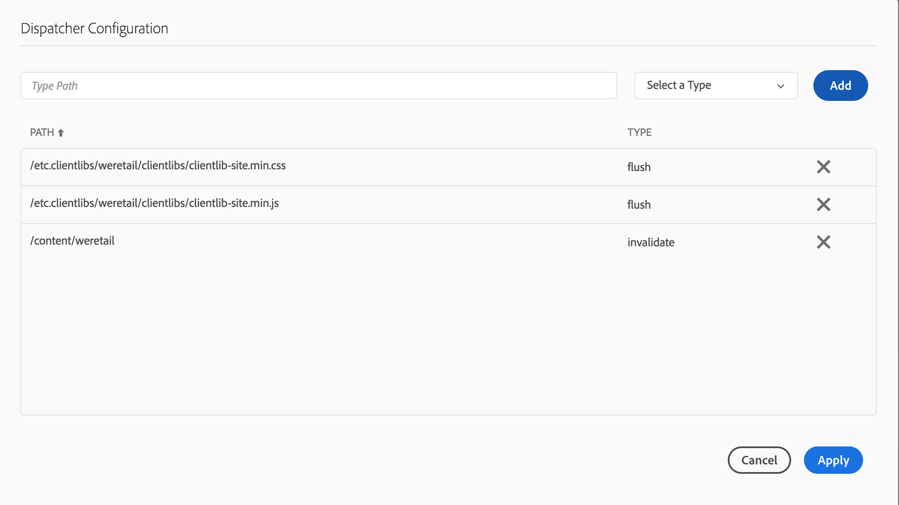
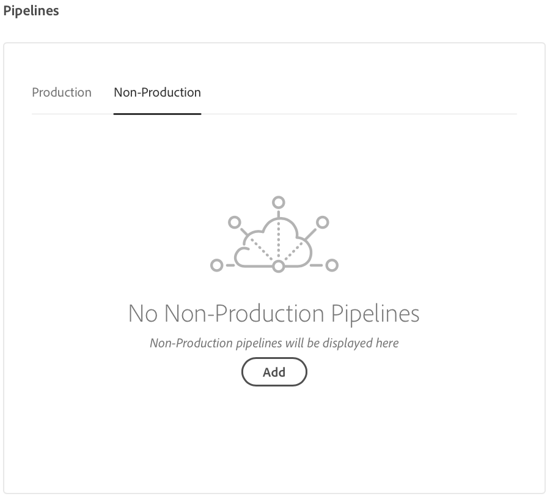
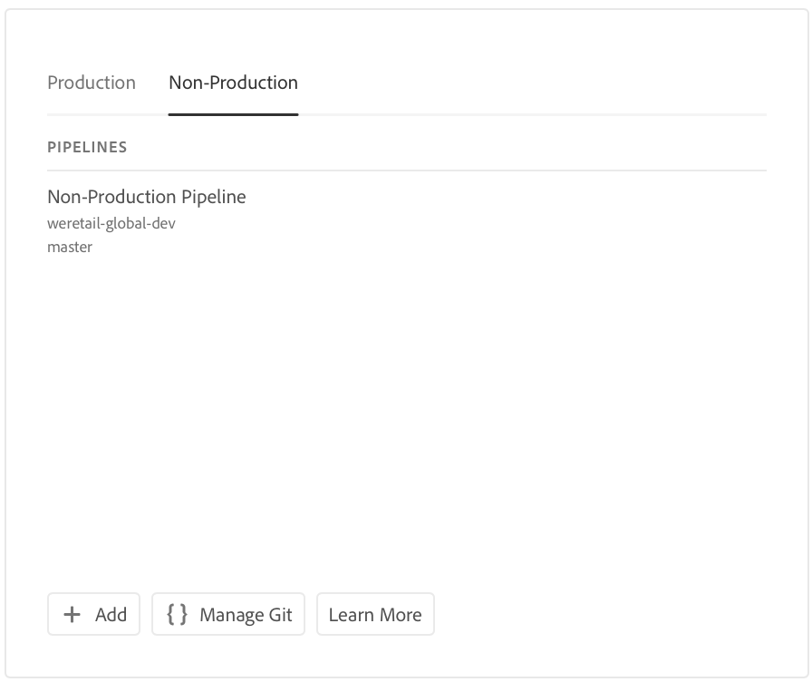

# Configure your CI/CD Pipeline {#configure-your-ci-cd-pipeline}

På följande sida beskrivs hur du konfigurerar **pipeline**. Mer information om hur pipeline fungerar finns i [CI/CD-översikten](ci-cd-pipeline.md).

## Videosjälvstudiekurs {#video-tutorial-one}

### Konfigurera pipeline i Cloud Manager {#config-pipeline-video}

CI/CD Production Pipeline-konfigurationen definierar den utlösare som initierar pipelinen, parametrar som styr produktionsdistributionen och parametrar för prestandatestning.

>[!VIDEO](https://video.tv.adobe.com/v/26314/)

## Förstå flödet {#understanding-the-flow}

Du kan konfigurera pipeline från panelen **Pipeline-inställningar** i [!UICONTROL Cloud Manager].

Distributionshanteraren ansvarar för att ställa in pipeline. När du gör det väljer du först en gren i **Git-databasen**. Pipeline-konfigurationen består av:

* definiera den utlösare som ska starta pipelinen.
* definiera parametrarna som styr produktionsdistributionen.
* konfigurera prestandatestparametrarna.

## Konfigurera pipeline {#setting-up-the-pipeline}

>[!CAUTION]
>
>Det går inte att konfigurera pipeline förrän Git-databasen har minst en gren och [programinstallationen](setting-up-program.md) är klar.

Innan du börjar distribuera koden måste du konfigurera dina pipeline-inställningar från [!UICONTROL Cloud Manager].

>[!NOTE]
>
>Du kan ändra pipeline-inställningarna efter den första konfigurationen.

### Konfigurera Pipeline-inställningarna från [!UICONTROL Cloud Manager] {#configuring-the-pipeline-settings-from-cloud-manager}

När du har konfigurerat programmet med [!UICONTROL Cloud Manager] användargränssnittet är du redo att konfigurera ditt flöde.

Följ de här stegen för att konfigurera beteendet och inställningarna för din pipeline:

1. Klicka på **Konfigurera pipeline** för att konfigurera och konfigurera din pipeline.

   

1. Skärmen **Konfigurera pipeline** visas.

   Med guiden i tre steg kan du konfigurera **grenen**, **miljön** och **testmiljön** .
Välj din Git-gren och klicka på **Nästa**.

   >[!NOTE]
   >
   >Förgreningar som hittas i Git-databasen är länkade till ditt program.

   

1. Gå till fliken **Miljö** och välj alternativ för **scen** och **produktion** .

   Du kan definiera utlösaren för att starta pipelinen:

   * **På Git Changes** - startar CI/CD-pipeline när implementeringar har lagts till i den konfigurerade Git-grenen. Även om du väljer det här alternativet kan du alltid starta pipelinen manuellt.
   * **Manuell** - med användargränssnittet startar du pipelinen manuellt.
   Under pipeline-konfigurationen eller redigeringen kan Deployment Manager definiera pipeline-beteendet när ett viktigt fel inträffar i någon av kvalitetsportarna, till exempel kodkvalitet, säkerhetstestning och prestandatestning.

   Detta är användbart för kunder som vill ha mer automatiserade processer. De tillgängliga alternativen är:

* **Fråga varje gång** - Det här är standardinställningen och kräver manuell åtgärd vid viktiga fel.
* **Misslyckas omedelbart** - Om du väljer det här alternativet avbryts pipelinen varje gång ett viktigt fel inträffar. Detta emulerar i princip en användare som manuellt avvisar varje fel.
* **Fortsätt omedelbart** - Om du väljer det här alternativet fortsätter pipeline automatiskt när ett viktigt fel inträffar. Detta emulerar i princip en användare som manuellt godkänner varje fel.

   Nu definierar du parametrarna som styr produktionsdistributionen. De tre tillgängliga alternativen är följande:

* **Använd Go Live Approval** - en distribution måste godkännas manuellt av en företagsägare, projektledare eller driftsättningshanterare via [!UICONTROL Cloud Manager] användargränssnittet.
* **Använd CSE Oversight** - en CSE är engagerad för att starta distributionen. Under pipeline-konfiguration eller redigering när CSE Oversight är aktiverat kan Distributionshanteraren välja:

   * **Alla fall**: refererar till en tillgänglig CSE
   * **Mitt fall**: avser en specifik CSE som tilldelats kunden eller deras säkerhetskopia, om CSE-enheten är utanför kontoret

* **Schemalagd** - Med det här alternativet kan användaren aktivera den schemalagda produktionsdistributionen.

>[!NOTE]
>
>Om du väljer alternativet **Schemalagd** kan du schemalägga din produktionsdistribution till pipeline **efter** scendistributionen (och **Använd GoLive Approval**, om det har aktiverats) för att vänta på att ett schema ska anges. Användaren kan också välja att köra produktionsdistributionen direkt.
>
>Se [**Distribuera koden **](deploying-code.md)för att ställa in distributionsschemat eller köra produktionen direkt.

>[!NOTE]
>
>Alternativet **Använd CSE-översikt** är inte tillgängligt för alla kunder.

**Godkänn efter scendistribution**

Det finns ett valfritt steg **Godkänn efter scendistributionen** som kan konfigureras i produktionspipelinen.
Det här är aktiverat i ett nytt alternativ på **skärmen för redigering** av pipeline:

Det visas sedan som ett separat steg under pipeline-körningen:

>[!NOTE]
>
>**Godkänn efter scendistributionen** fungerar på liknande sätt som godkännandet före produktionsdistributionen, men sker direkt efter scenens distributionssteg, det vill säga innan någon testning görs, jämfört med godkännandet före produktionsdistributionen, som görs när all testning är slutförd.

**Dispatcher Invalidation**

Som distributionshanterare kan du konfigurera en uppsättning innehållssökvägar som antingen blir **ogiltiga** eller **tömda** från AEM Dispatcher-cachen när du konfigurerar eller redigerar pipeline.

Du kan konfigurera en separat uppsättning sökvägar för Stage- och Production-distribution. Om den är konfigurerad kommer dessa cacheåtgärder att utföras som en del av distributionssteget, precis efter att innehållspaket har distribuerats. De här inställningarna använder standardbeteendet AEM Dispatcher - invalidate utför en cacheogiltigförklaring som liknar när innehåll aktiveras från författaren till publiceringen. rensning utför en cacheborttagning.

I allmänhet är det bättre att använda åtgärden invalidate, men det kan finnas fall där det krävs tömning, särskilt när du använder AEM HTML-klientbibliotek.

>[!NOTE]
>
>Mer information om Dispatcher-cachning finns i [Dispatcher Overview](dispatcher-configurations.md) .

Följ stegen nedan för att konfigurera Dispatcher Invalidations:

1. Klicka på **Konfigurera** under rubriken Dispatcher Configuration

   

1. Ange sökvägen, välj åtgärden i **Text** och klicka på **Lägg till**. Du kan ange upp till 100 sökvägar per miljö. När du har lagt till banorna klickar du på **Använd**.

   

1. När du är tillbaka på sidan **Pipelinainställningar** visas en uppdaterad sammanfattning av valen.

   Klicka på **Spara** för att behålla konfigurationen.

   

1. Gå till fliken **Testning** för att definiera testvillkoren för programmet.

   Nu kan du konfigurera prestandatestparametrarna.

   Du kan konfigurera *AEM Sites* och *AEM Assets* Performance Testing, beroende på vilka produkter du har licensierat.

   **AEM Sites:**

   Cloud Manager kör prestandatestning för AEM Sites-program genom att begära sidor (som en oautentiserad användare) på scenens publiceringsserver under en 30-minuters testperiod och mäta svarstiden för varje sida samt olika mätvärden på systemnivå.Sidorna väljs av tre **siduppsättningar**. du kan välja var som helst från en till alla tre uppsättningar. Trafikfördelningen baseras på antalet valda grupper, dvs. om alla tre är markerade placeras 33 % av de totala sidvyerna mot varje uppsättning. Om två är markerade går 50 % till varje uppsättning. om en sådan väljs, går 100 % av trafiken till den uppsättningen.

   Låt oss till exempel säga att det finns en delning på 50 %/50 % mellan de populära Live-sidorna och de nya sidorna (i det här exemplet används inte andra Live-sidor) och den nya siduppsättningen innehåller 3 000 sidor. Sidvyerna per minut är inställda på 200. Under 30 minuters testperiod:

   * Var och en av de 25 sidorna i populära Live Pages-uppsättningen kommer att visas 240 gånger - ((200 * 0.5) / 25) * 30 = 120

   * Var och en av de 3 000 sidorna i den nya siduppsättningen kommer att tryckas en gång - ((200 * 0.5) / 3 000) * 30 = 1
   

   **AEM Assets:**

   Cloud Manager kör prestandatestning för AEM Assets-program genom att överföra resurser upprepade gånger under en 30-minuters testperiod och mäta bearbetningstiden för varje resurs samt olika mätvärden på systemnivå. Denna funktion kan överföra både bilder och PDF-dokument. Distributionen av hur många resurser av varje typ som överförs per minut anges på skärmen Inställningar för pipeline eller Redigera.

   Om t.ex. en delning på 70/30 används, vilket visas i figuren nedan. 10 resurser överförs per minut, 7 bilder överförs per minut och 3 dokument.

   

   >[!NOTE]
   >
   >Det finns en standardbild och ett PDF-dokument, men i de flesta fall vill kunderna överföra sina egna resurser. Detta kan du göra på skärmen Inställningar för pipeline eller Redigera. Vanliga bildformat som JPEG, PNG, GIF och BMP stöds tillsammans med Photoshop-, Illustrator- och Postscript-filer.

1. Klicka på **Spara** för att slutföra konfigurationen av pipeline-processen.

   >[!NOTE]
   >
   >När du har konfigurerat pipeline kan du dessutom fortfarande redigera inställningar för samma produkt med hjälp av **inställningspanelen för** produktionsförlopp i [!UICONTROL Cloud Manager] användargränssnittet.

   

## Icke-produktion och endast kodkvalitet, rörledningar

Förutom den huvudsakliga rörledningen som distribuerar till scenen och produktionen kan kunderna även lägga upp ytterligare rörledningar, så kallade **icke-produktionsrörledningar**. Dessa pipelines kör alltid stegen för bygg- och kodkvalitet. De kan också distribuera till Adobes miljö för hanterade tjänster.

## Videosjälvstudiekurs {#video-tutorial-two}

### Cloud Manager - endast icke-produktion- och kodkvalitet {#non-prod-video}

Rörledningar för komprimerad/cd-produktion delas upp i två kategorier, nämligen pipelines för kodkvalitet och distributionsrörledningar. Kodkvalitetsledningarna genererar all kod från en Git-gren och utvärderas mot Cloud Managers skanning av kodkvalitet.

>[!VIDEO](https://video.tv.adobe.com/v/26316/)

På startskärmen visas dessa rörledningar i ett nytt kort:

1. Gå till **icke-produktionsförloppsindikatorn** från startskärmen i Cloud Manager.

   

1. Klicka på knappen Lägg till för att ange Pipelinenamn, Pipelinetyp och Git-grenen.

   Dessutom kan du konfigurera utlösare för distribution och Beteende för viktigt fel i alternativen för pipeline.

   

1. Klicka på **Spara** och pipeline visas på kortet på startskärmen med tre åtgärder:

   * **Redigera** - tillåter redigering av pipeline-inställningarna
   * **Detalj** - visar den senaste pipelinekörningen (om det finns någon)
   * **Build** - navigerar till körningssidan, från vilken pipeline kan köras
   

   >[!NOTE]
   >
   >Medan pipeline körs visas det aktuella steget och endast åtgärden **Detaljer** är tillgänglig.

## Nästa steg {#the-next-steps}

När du har konfigurerat pipeline måste du distribuera koden.

Mer information finns i [Distribuera koden](deploying-code.md) .
