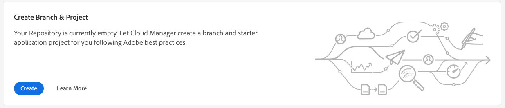
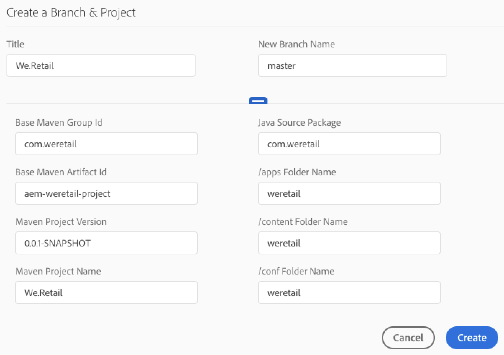

# Create an AEM Application Project {#create-an-aem-application-project}

## Använda guiden för att skapa ett AEM-programprojekt {#using-wizard-to-create-an-aem-application-project}

När kunderna är ombord på Cloud Manager får de en tom Git-databas. Nuvarande Adobe Managed Services (AMS-kunder) (eller lokala AEM-kunder som migrerar till AMS) har vanligtvis redan sin projektkod i Git (eller något annat versionskontrollsystem) och kommer att importera sitt projekt till Cloud Managers Git-databas. Nya kunder har dock inga befintliga projekt.

För att hjälpa nya kunder att komma igång kan Cloud Manager nu skapa ett minimalt AEM-projekt som utgångspunkt. Processen bygger på [**AEM Project Archetype **](https://github.com/Adobe-Marketing-Cloud/aem-project-archetype).


Följ stegen nedan för att skapa ett AEM-programprojekt i Cloud Manager:

1. När du har loggat in på Cloud Manager och den grundläggande programkonfigurationen är klar, visas ett särskilt CTA-kort på skärmen **Översikt**, om databasen är tom.

   

1. Klicka på **Skapa för att** öppna en dialogruta där användaren kan ange de parametrar som krävs för AEM-projektarkitekturen. I standardformuläret frågar dialogrutan efter två värden:

   * **Titel** - som standard är detta inställt på *Programnamn*

   * **Nytt grennamn** - som standard är detta *överordnad*

   

   Dialogrutan har en låda som du kan öppna genom att klicka på handtaget längst ned i dialogrutan. I den utökade versionen av dialogrutan visas alla konfigurationsparametrar för Arketypen. Många av dessa parametrar har standardvärden som genereras baserat på **titeln**.

   

   >[!NOTE]
   >
   >Om t.ex. **Title** är ***We.Finance*** genereras parametern Base Maven Artifact Id som ***com.weFinance***. Om du vill kan du ändra dessa värden.
   >
   >
   >Du kan till exempel ändra från det genererade ***värdet com.weFinance*** till ***net.weFinance***.

1. Klicka på **Skapa** i det föregående steget för att skapa startprojektet med hjälp av arkitypen och spara i den namngivna Git-grenen. När det är klart kan du konfigurera pipeline.

## Konfigurera projektet {#setting-up-your-project}

### Ändra projektinställningsinformation {#modifying-project-setup-details}

För att kunna byggas och driftsättas med Cloud Manager måste befintliga AEM-projekt följa vissa grundläggande regler:

* Projekt måste byggas med Apache Maven.
* Det måste finnas en *pom.xml* -fil i Git-databasens rot. Den här *pom.xml* -filen kan referera till så många undermoduler (som i sin tur kan ha andra undermoduler osv.) vid behov.

* Du kan lägga till referenser till ytterligare Maven-artefaktdatabaser i dina *pom.xml* -filer. Åtkomst till lösenordsskyddade eller nätverksskyddade artefaktarkiv stöds dock inte.
* Distribuerbara innehållspaket upptäcks genom att söka efter *zip* -filer för innehållspaket som finns i en katalog med namnet *target*. Ett valfritt antal undermoduler kan producera innehållspaket.

* Distribuerbara Dispatcher-artefakter upptäcks genom att söka efter *zip* -filer (återigen i en katalog med namnet *target*) som har katalogerna *conf* och *conf.d*.

* Om det finns mer än ett innehållspaket är det inte säkert att paketdistributioner ordnas. Om en viss ordning behövs kan innehållspaketets beroenden användas för att definiera ordningen. Paket kan [hoppas över](#skipping-content-packages) från distributionen.

<!-- 

Comment Type: annotation
Last Modified By: jsyal
Last Modified Date: 2018-10-08T09:20:10.106-0400

2018.8.0: added existing in the opening sentence

 -->

## Information om byggmiljö {#build-environment-details}

Cloud Manager bygger och testar koden med en specialiserad byggmiljö. Den här miljön har följande attribut:

* Byggmiljön är Linux-baserad och kommer från Ubuntu 18.04.
* Apache Maven 3.6.0 är installerad.
* De installerade Java-versionerna är Oracle JDK 8u202 och 11.0.2.
* Det finns ytterligare systempaket installerade som är nödvändiga:

   * bzip2
   * uppzip
   * libpng
   * imagemagick
   * grafikSnabb

* Andra paket kan installeras vid byggtillfället enligt beskrivningen [nedan](#installing-additional-system-packages).
* Varje bygge görs i en riktig miljö. byggbehållaren behåller inte något läge mellan körningar.
* Maven körs alltid med kommandot: *mvn —batch-mode clean org.jacoco:jacoco-maven-plugin:prepare-agent package*
* Maven konfigureras på systemnivå med filen settings.xml som automatiskt inkluderar den offentliga Adobe **Artifact** -databasen. (Mer information finns i [Adobe Public Maven Repository](https://repo.adobe.com/) .)

>[!NOTE]
>Även om Cloud Manager inte definierar en specifik version av `jacoco-maven-plugin`filen måste den version som används vara minst `0.7.5.201505241946`.

### Använda Java 11 {#using-java-11}

Cloud Manager har nu stöd för att bygga kundprojekt med både Java 8 och Java 11. Som standard byggs projekt med Java 8. Kunder som tänker använda Java 11 i sina projekt kan göra det med [Apache Maven Toolchains Plugin](https://maven.apache.org/plugins/maven-toolchains-plugin/).

Det gör du genom att lägga till en post som ser ut så här i filen pom.xml: `<plugin>`

```xml
        <plugin>
            <groupId>org.apache.maven.plugins</groupId>
            <artifactId>maven-toolchains-plugin</artifactId>
            <version>1.1</version>
            <executions>
                <execution>
                    <goals>
                        <goal>toolchain</goal>
                    </goals>
                </execution>
            </executions>
            <configuration>
                <toolchains>
                    <jdk>
                        <version>11</version>
                        <vendor>oracle</vendor>
                    </jdk>
                </toolchains>
            </configuration>
        </plugin>
```

>[!NOTE]
>De `vendor` värden som stöds är `oracle` och `sun` och de `version` värden som stöds är `1.8`, `1.11`och `11`.

## Miljövariabler {#environment-variables}

### Standardmiljövariabler {#standard-environ-variables}

I vissa fall tycker kunderna att det är nödvändigt att variera byggprocessen baserat på information om programmet eller pipeline.

Om JavaScript-minifiering under byggtid utförs, till exempel med hjälp av ett verktyg som Glup, kan det finnas en önskan att använda en annan Minification-nivå när du skapar för en utvecklingsmiljö i stället för att bygga för scenen och produktionen.

Som stöd för detta lägger Cloud Manager till dessa standardmiljövariabler i byggbehållaren för varje körning.

| **Variabelnamn** | **Definition** |
|---|---|
| CM_BUILD | Alltid inställd på &quot;true&quot; |
| BRANSCHER | Den konfigurerade grenen för körningen |
| CM_PIPELINE_ID | Den numeriska pipeline-identifieraren |
| CM_PIPELINE_NAME | Pipeline-namnet |
| CM_PROGRAM_ID | Den numeriska programidentifieraren |
| CM_PROGRAM_NAME | Programnamnet |
| ARTIFACTS_VERSION | Den syntetiska versionen som genererats av Cloud Manager för en fas eller produktionsprocess |

### Rörledningsvariabler {#pipeline-variables}

I vissa fall kan en kunds byggprocess vara beroende av specifika konfigurationsvariabler som skulle vara olämpliga att placera i Git-databasen eller som behöver variera mellan olika pipeline-körningar som använder samma gren.

Med Cloud Manager kan dessa variabler konfigureras via Cloud Manager API eller Cloud Manager CLI per pipeline. Variabler kan lagras som antingen ren text eller krypteras i vila. I båda fallen görs variabler tillgängliga i byggmiljön som en miljövariabel som sedan kan refereras inifrån `pom.xml` filen eller andra byggskript.

Om du vill ange en variabel med hjälp av CLI kör du ett kommando som:

`$ aio cloudmanager:set-pipeline-variables PIPELINEID --variable MY_CUSTOM_VARIABLE test`

Aktuella variabler kan listas:

`$ aio cloudmanager:list-pipeline-variables PIPELINEID`

Variabelnamn får endast innehålla alfanumeriska tecken och understreck (_). Namnen ska vara versaler. Det finns en gräns på 200 variabler per pipeline. Varje namn måste innehålla färre än 100 tecken och varje värde måste innehålla färre än 2 048 tecken.

När de används i en `Maven pom.xml` fil är det praktiskt att mappa dessa variabler till Maven-egenskaper med en syntax som liknar den här:

```xml
        <profile>
            <id>cmBuild</id>
            <activation>
                <property>
                    <name>env.CM_BUILD</name>
                </property>
            </activation>
            <properties>
                <my.custom.property>${env.MY_CUSTOM_VARIABLE}</my.custom.property> 
            </properties>
        </profile>
```

## Aktivera Maven-profiler i Cloud Manager {#activating-maven-profiles-in-cloud-manager}

I vissa begränsade fall kan du behöva ändra din byggprocess något när du kör i Cloud Manager i stället för när den körs på arbetsstationer för utvecklare. I dessa fall kan [Maven Profiles](https://maven.apache.org/guides/introduction/introduction-to-profiles.html) användas för att definiera hur bygget ska vara olika i olika miljöer, inklusive Cloud Manager.

Aktivering av en Maven-profil i Cloud Managers byggmiljö bör göras genom att söka efter miljövariabeln CM_BUILD som beskrivs ovan. En profil som bara är avsedd att användas utanför Cloud Managers byggmiljö bör däremot göras genom att leta efter variabelns bakgrund.

Om du till exempel bara vill visa ett enkelt meddelande när bygget körs i Cloud Manager gör du följande:

```xml
        <profile>
            <id>cmBuild</id>
            <activation>
                  <property>
                        <name>env.CM_BUILD</name>
                  </property>
            </activation>
            <build>
                <plugins>
                    <plugin>
                        <artifactId>maven-antrun-plugin</artifactId>
                        <version>1.8</version>
                        <executions>
                            <execution>
                                <phase>initialize</phase>
                                <configuration>
                                    <target>
                                        <echo>I'm running inside Cloud Manager!</echo>
                                    </target>
                                </configuration>
                                <goals>
                                    <goal>run</goal>
                                </goals>
                            </execution>
                        </executions>
                    </plugin>
                </plugins>
            </build>
        </profile>
```

>[!NOTE]
>
>Om du vill testa den här profilen på en arbetsstation för utvecklare kan du antingen aktivera den på kommandoraden (med `-PcmBuild`) eller i den integrerade utvecklingsmiljön (IDE).

Om du bara vill få ut ett enkelt meddelande när bygget körs utanför Cloud Manager gör du det här:

```xml
        <profile>
            <id>notCMBuild</id>
            <activation>
                  <property>
                        <name>!env.CM_BUILD</name>
                  </property>
            </activation>
            <build>
                <plugins>
                    <plugin>
                        <artifactId>maven-antrun-plugin</artifactId>
                        <version>1.8</version>
                        <executions>
                            <execution>
                                <phase>initialize</phase>
                                <configuration>
                                    <target>
                                        <echo>I'm running outside Cloud Manager!</echo>
                                    </target>
                                </configuration>
                                <goals>
                                    <goal>run</goal>
                                </goals>
                            </execution>
                        </executions>
                    </plugin>
                </plugins>
            </build>
        </profile>
```

## Installera ytterligare systempaket {#installing-additional-system-packages}

Vissa byggen kräver att ytterligare systempaket installeras för att fungera helt. Ett bygge kan till exempel anropa ett Python- eller ruby-skript och därför måste ha en lämplig språktolk installerad. Detta kan du göra genom att anropa [exec-maven-plugin](https://www.mojohaus.org/exec-maven-plugin/) för att anropa APT. Den här exekveringen bör normalt omslutas av en molnhanterarspecifik Maven-profil. Så här installerar du python:

```xml
        <profile>
            <id>install-python</id>
            <activation>
                <property>
                        <name>env.CM_BUILD</name>
                </property>
            </activation>
            <build>
                <plugins>
                    <plugin>
                        <groupId>org.codehaus.mojo</groupId>
                        <artifactId>exec-maven-plugin</artifactId>
                        <version>1.6.0</version>
                        <executions>
                            <execution>
                                <id>apt-get-update</id>
                                <phase>validate</phase>
                                <goals>
                                    <goal>exec</goal>
                                </goals>
                                <configuration>
                                    <executable>apt-get</executable>
                                    <arguments>
                                        <argument>update</argument>
                                    </arguments>
                                </configuration>
                            </execution>
                            <execution>
                                <id>install-python</id>
                                <phase>validate</phase>
                                <goals>
                                    <goal>exec</goal>
                                </goals>
                                <configuration>
                                    <executable>apt-get</executable>
                                    <arguments>
                                        <argument>install</argument>
                                        <argument>-y</argument>
                                        <argument>--no-install-recommends</argument>
                                        <argument>python</argument>
                                    </arguments>
                                </configuration>
                            </execution>
                        </executions>
                    </plugin>
                </plugins>
            </build>
        </profile>
```

Samma teknik kan användas för att installera språkspecifika paket, dvs. med `gem` för RubyGems eller `pip` för Python-paket.

>[!NOTE]
>
>Om du installerar ett systempaket på det här sättet installeras det **inte** i körningsmiljön som används för att köra Adobe Experience Manager. Om du behöver ett systempaket som är installerat i AEM-miljön kontaktar du CSE (Customer Success Engineers).

## Hoppar över innehållspaket {#skipping-content-packages}

I Cloud Manager kan byggen producera valfritt antal innehållspaket.
Det kan av olika skäl vara önskvärt att skapa ett innehållspaket men inte distribuera det. Detta kan till exempel vara användbart när du skapar innehållspaket som bara används för testning eller som paketeras om med ett annat steg i byggprocessen, det vill säga som ett underpaket till ett annat paket.

För att hantera dessa scenarier söker Cloud Manager efter egenskapen ***cloudManagerTarget*** i egenskaperna för de byggda innehållspaketen. Om den här egenskapen är inställd på ”ingen” hoppas paketet över och driftsätts inte. Mekanismen för hur den här egenskapen anges beror på hur innehållspaketet skapas. Med till exempel filevault-maven-plugin konfigurerar du plugin-programmet så här:

```xml
        <plugin>
            <groupId>org.apache.jackrabbit</groupId>
            <artifactId>filevault-package-maven-plugin</artifactId>
            <extensions>true</extensions>
            <configuration>
                <properties>
                    <cloudManagerTarget>none</cloudManagerTarget>
                </properties>
        <!-- other configuration -->
            </configuration>
        </plugin>
```

Med content-package-maven-plugin är den ungefär så här:

```xml
        <plugin>
            <groupId>com.day.jcr.vault</groupId>
            <artifactId>content-package-maven-plugin</artifactId>
            <extensions>true</extensions>
            <configuration>
                <properties>
                    <cloudManagerTarget>none</cloudManagerTarget>
                </properties>
        <!-- other configuration -->
            </configuration>
        </plugin>
```

## Utveckla din kod baserat på bästa praxis {#develop-your-code-based-on-best-practices}

Adobes tekniker och konsultteam har utvecklat en [omfattande uppsättning metodtips för AEM-utvecklare](https://helpx.adobe.com/experience-manager/6-4/sites/developing/using/best-practices.html).
