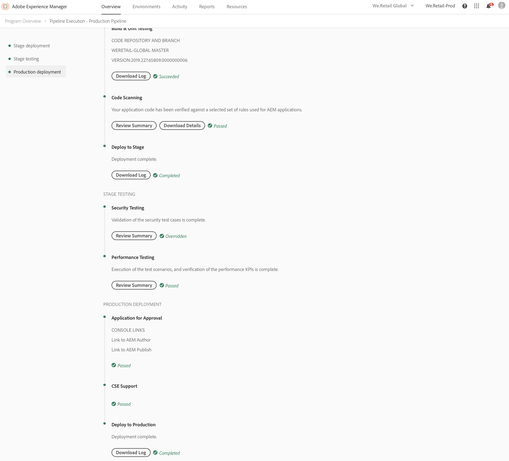
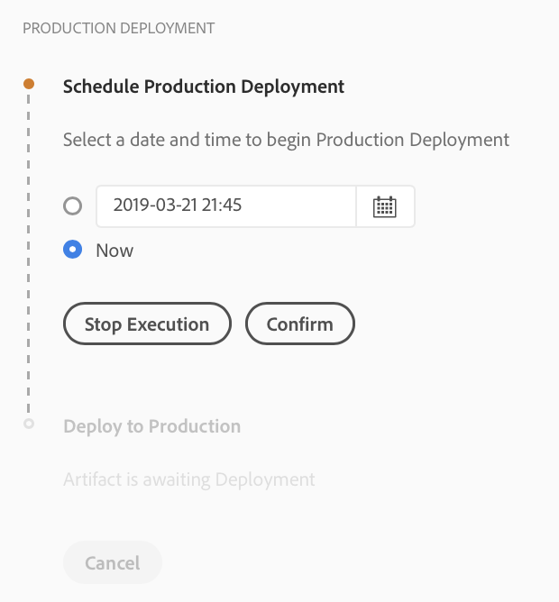
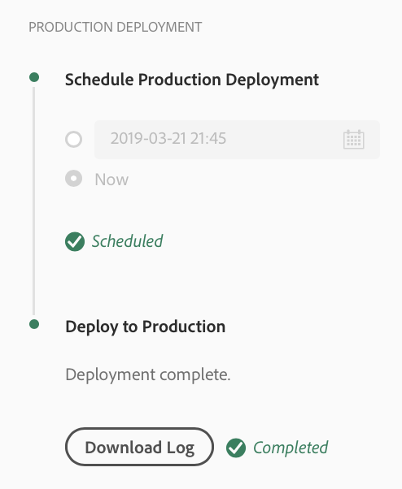

# Distribuera koden {#deploy-your-code}

## Distribuera kod med Cloud Manager {#deploying-code-with-cloud-manager}

När du har konfigurerat produktionspipelinen (databas, miljö och testmiljö) är du redo att distribuera koden.

1. Klicka på **Distribuera** från Cloud Manager för att starta distributionsprocessen.

   

1. Skärmen **Pipeline Execution** visas.

   Klicka på **Skapa** för att starta processen.

   

1. Den fullständiga byggprocessen distribuerar koden.

   Följande steg ingår i byggprocessen:

   1. Scendistribution
   1. Scentestning
   1. Produktionsdistribution

   >[!NOTE]
   >
   >Dessutom kan du granska stegen från olika distributionsprocesser genom att visa loggar eller granska resultaten för att se testvillkoren.

   Följande steg ingår i **mellanlagringsdistributionen**:

   * Validering: Detta steg säkerställer att pipeline är konfigurerad att använda de tillgängliga resurserna, till exempel att den konfigurerade grenen finns, och att miljöerna är tillgängliga.
   * Build &amp; Unit Testing: Det här steget kör en innesluten byggprocess. Mer information om byggmiljön finns i [Skapa ett AEM-programprojekt](create-an-application-project.md) .
   * Kodsökning: I det här steget utvärderas kvaliteten på programkoden. Se [Förstå testresultaten](understand-your-test-results.md) för mer information om testprocessen.
   * Distribuera till scenen

   

   The **Stage Testing**, involves the following steps:

   * Säkerhetstestning: I det här steget utvärderas säkerhetseffekten av programkoden på AEM. Se [Förstå testresultaten](understand-your-test-results.md) för mer information om testprocessen.
   * Prestandatestning: I det här steget utvärderas prestanda för programkoden. Se [Förstå testresultaten](understand-your-test-results.md) för mer information om testprocessen.

   

   The **Production Deployment**, involves the following steps:

   * **Ansökan om godkännande** (om aktiverad)
   * **Schemalägg produktionsdistribution** (om aktiverat)
   * **CSE-stöd** (om aktiverat)
   * **Distribuera till produktion**

   

   >[!NOTE]
   >
   >Schemalägg **produktionsdistribution** är aktiverat när pipeline konfigureras.
   >
   >
   >Med det här alternativet kan du antingen schemalägga produktionsdistributionen eller klicka på **Nu** för att köra produktionsdistributionen direkt.
   >
   >
   >Det schemalagda datumet och den schemalagda tiden anges i användarens tidszon.
   >
   >
   >Klicka på **Bekräfta** för att bekräfta inställningarna.

   

   När du har bekräftat distributionsschemat slutförs koddistributionen.

   Följande skärm visas när alternativet **Nu** är valt i ovanstående steg.

   

## Distributionsprocess {#deployment-process}

I följande avsnitt beskrivs hur AEM- och dispatcherpaket distribueras i scenfasen och i produktionsfasen.

Cloud Manager överför alla mål-/*.zip-filer som skapas i byggprocessen till en lagringsplats.  Artefakterna hämtas från den här platsen under pipelinens distributionsfaser.

När Cloud Manager distribuerar till icke-produktionstopologier är målet att slutföra distributionen så snabbt som möjligt och artefakterna distribueras därför till alla noder samtidigt enligt följande:

1. Cloud Manager avgör om varje artefakt är ett AEM- eller dispatcherpaket.
1. Cloud Manager tar bort alla utskickare från belastningsutjämnaren för att isolera miljön under distributionen.

   Om du inte konfigurerar något annat kan du hoppa över ändringar av belastningsutjämnare i Dev- och Stage-distributioner, d.v.s. koppla från och bifoga steg i både icke-produktionspipelines, dev-miljöer och produktionsflödet för scenmiljöer.

   

   >[!NOTE]
   >
   >Den här funktionen förväntas främst användas av 1-1-1-kunder.

1. Varje AEM-artefakt distribueras till varje AEM-instans via API:er för Package Manager, där paketberoenden avgör distributionsordningen.

   Mer information om hur du kan använda paket för att installera nya funktioner, överföra innehåll mellan instanser och säkerhetskopiera databasinnehåll finns i Så här arbetar du med paket.

   >[!NOTE]
   >
   >Alla AEM artefakter distribueras till både författaren och utgivaren. Körningslägen bör utnyttjas när nodspecifika konfigurationer krävs. Om du vill veta mer om hur körningslägena gör att du kan justera AEM för ett visst ändamål, se Körningslägen.

1. Dispatchartefakten distribueras till varje dispatcher enligt följande:

   1. Aktuella konfigurationer säkerhetskopieras och kopieras till en temporär plats
   1. Alla konfigurationer tas bort utom de oföränderliga filerna. Mer information finns i Hantera dina Dispatcher-konfigurationer. Detta rensar katalogerna för att säkerställa att inga överblivna filer lämnas kvar.
   1. Artefakten extraheras till `httpd` katalogen.  Oändringsbara filer skrivs inte över. Alla ändringar du gör i oföränderliga filer i Git-databasen ignoreras vid distributionen.  Dessa filer är viktiga för AMS-dispatcherramverket och kan inte ändras.
   1. Apache utför ett config-test. Om inga fel hittas läses tjänsten in igen. Om ett fel inträffar återställs konfigurationerna från en säkerhetskopia, tjänsten läses in igen och felet rapporteras tillbaka till Cloud Manager.
   1. Varje sökväg som anges i pipeline-konfigurationen görs ogiltig eller töms från dispatchercachen.

   >[!NOTE]
   >
   >Dispatcher-artefakten förväntas innehålla hela filuppsättningen.  Alla konfigurationsfiler för dispatcher måste finnas i Git-databasen. Om filer eller mappar saknas kommer distributionen att misslyckas.

1. Efter den lyckade distributionen av alla AEM- och dispatcherpaket till alla noder läggs avsändarna tillbaka till belastningsutjämnaren och distributionen är klar.

   >[!NOTE]
   >
   >Du kan hoppa över ändringar av belastningsutjämnaren i utvecklings- och scendistributioner, det vill säga koppla loss och bifoga steg i både icke-produktionspipelines, för utvecklingsmiljöer och i produktionsflödet för scenmiljöer.

### Distribution till produktionsfas {#deployment-production-phase}

Processen för att distribuera till produktionstopologier skiljer sig något för att minimera påverkan för AEM webbplatsbesökare.

Produktionsinstallationer följer i allmänhet samma steg som ovan, men på ett rullande sätt:

1. Distribuera AEM som ska författas.
1. Koppla loss dispatcher1 från belastningsutjämnaren.
1. Distribuera AEM paket till publish1 och dispatcherpaketet till dispatcher1, flush dispatcher cache.
1. Placera dispatcher1 i belastningsutjämnaren igen.
1. När dispatcher1 är tillbaka i tjänst frigör du dispatcher2 från belastningsutjämnaren.
1. Distribuera AEM paket till publish2 och dispatcherpaketet till dispatcher2, flush dispatcher cache.
1. Placera dispatcher2 i belastningsutjämnaren igen.
Den här processen fortsätter tills distributionen har nått alla utgivare och utgivare i topologin.

