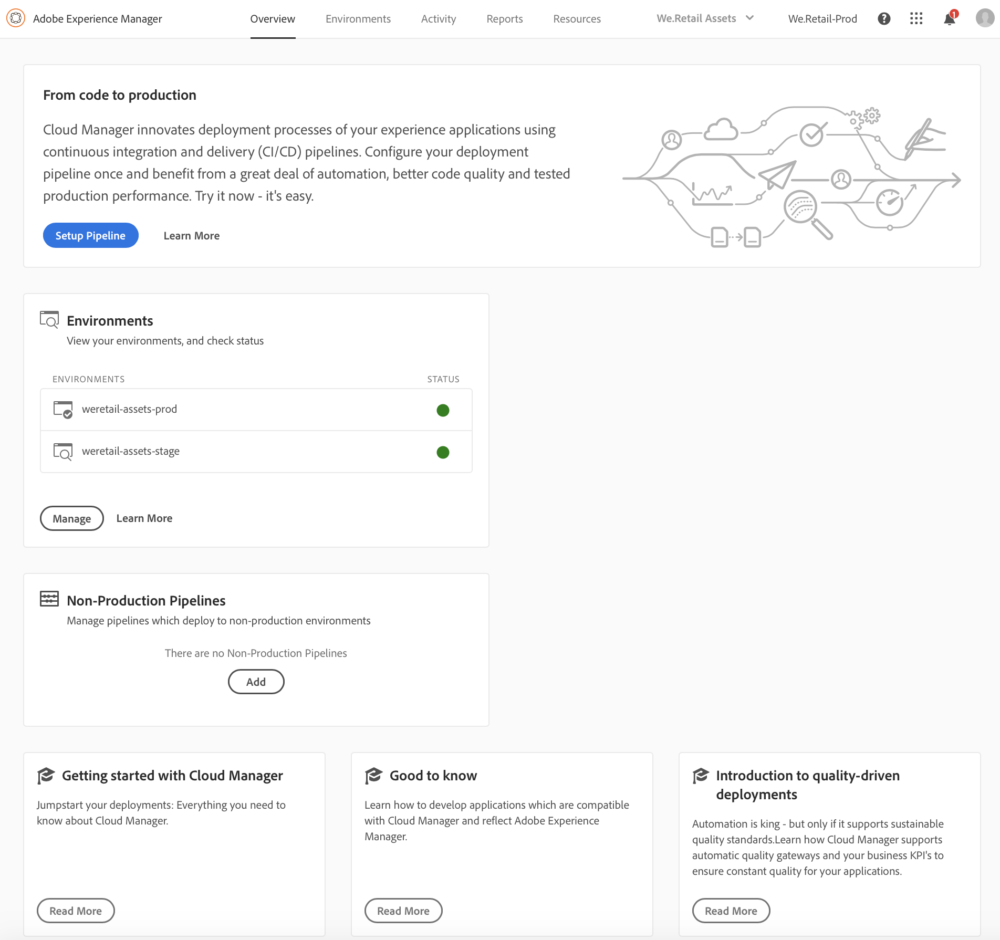

# Första gången du loggar in {#first-time-login}

När du har konfigurerat de allmänna konfigurationerna för [!UICONTROL Cloud Manager] är du redo att använda användargränssnittet (UI) för [!UICONTROL Cloud Manager].

>[!NOTE]
>Beroende på vilka roller som har tilldelats i [!UICONTROL Cloud Manager] och programmets status visas olika skärmar när du använder användargränssnittet för [!UICONTROL Cloud Manager].

## Loggar in för första gången {#logging-in-for-the-first-time}

1. Logga in på **Adobe[!UICONTROL Experience Cloud]** så ser du listan **Program**.

   

1. Markera programmet (till exempel **We.Retail Global**) och klicka på ikonen längst upp till vänster för att öppna [!UICONTROL Cloud Manager].

   

1. Kontrollpanelen för [!UICONTROL Cloud Manager] visas.

   

1. Klicka på **Konfigurera program** för att ange **programbeskrivningen** och definiera nyckeltal.

   >[!NOTE]
   >
   >Se [Konfigurera ditt program](https://helpx.adobe.com/experience-manager/cloud-manager/using/setting-up-program.html) för att slutföra nästa steg.

## Videosjälvstudiekurs {#video-tutorial-two}

### Fliken Aktivitet i molnhanteraren {#activity-video}

Cloud Manager ger en samlad vy över en aktivitet i ett program, med en lista över alla CI/CD Pipeline-körningar, både produktion och icke-produktion, som ger insyn i den tidigare och nuvarande aktiviteten och alla aktiviteters detaljer kan granskas.

>[!VIDEO](https://video.tv.adobe.com/v/26313/)
