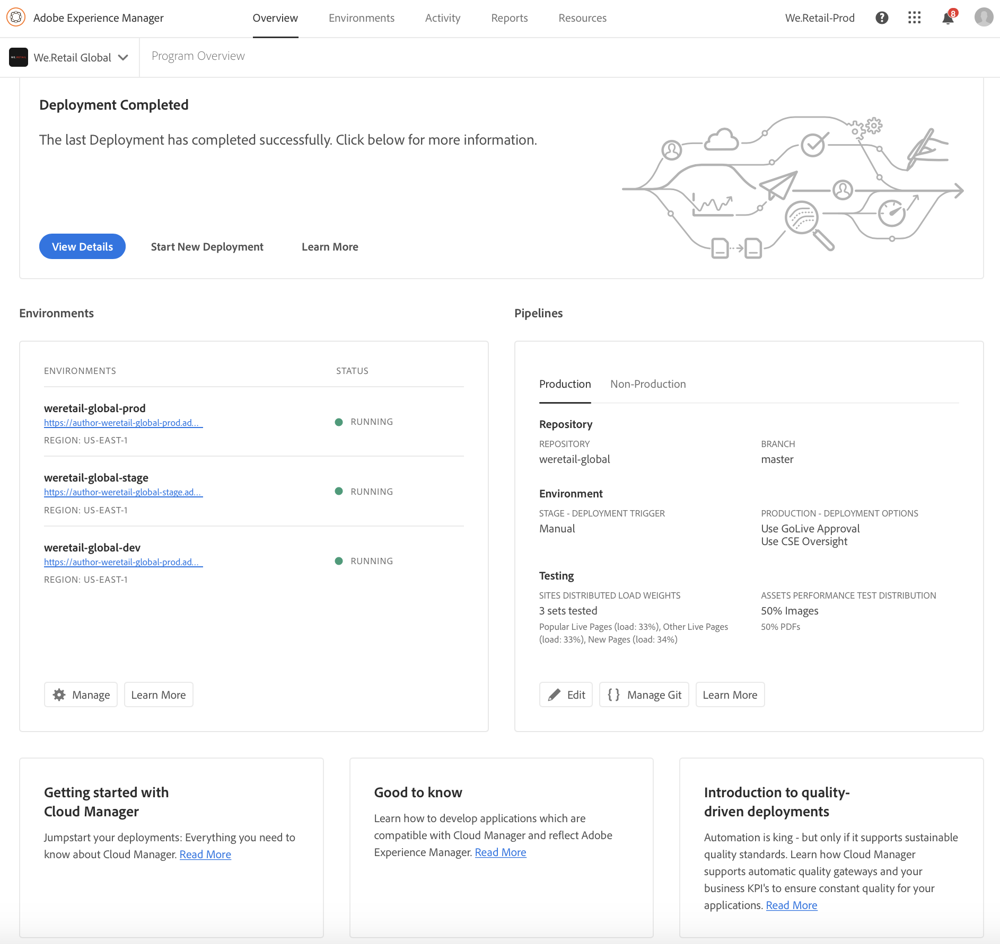

# Hantera dina miljöer {#manage-your-environments}

Sidan **Översikt** i Cloud Manager innehåller panelen **Miljöer** som listar alla hanterade AEM-miljöer.

Var och en av miljöerna i listan visar sin associerade status.

## Videosjälvstudiekurs {#video-tutorial}

### Översikt över Cloud Manager-miljön {#environ-video}

Följande video ger en översikt till Cloud Manager-miljöer som består av instanser av AEM Author, AEM Publish och Dispatcher.

>[!VIDEO](https://video.tv.adobe.com/v/26318/)

## Åtkomst till miljöer i Cloud Manager {#accessing-environments-in-cloud-manager}

Under **Miljöer** visas de produktions- och scenmiljöer som ingår i programmet tillsammans med status.

Statusen är det sammanslagna energiläget över alla noder i miljön. Det är grönt om alla noder körs, rött om till och med en nod stoppas, blått om till och med en nod kommer upp och gult om även en nod har ett energiläge som inte är tillgängligt (i den här prioritetsordningen).

### Miljöer {#environments}

Klicka på **Hantera** för att visa skärmen **för miljöer** .

På skärmen **för miljöer** visas ett kort för *produktions* - och *scenmiljöer* (beroende på vad som är tillämpligt) i programmet. Miljönamnet visas ovanför varje kort. Kortet innehåller en tabell med noder i miljön tillsammans med t-shirtstorleken för processorn, lagringsutrymmet, regionen och statusen.

>[!NOTE]
>
>Nodens **STATUS** representerar den virtuella datorns strömtillstånd och återspeglar inte status för AEM på servern. Statusen kan vara **Kör** (grön cirkel), **Stoppad** (röd cirkel), **Kommer upp** (blå cirkel) eller **Inte tillgänglig** (gul cirkel).

