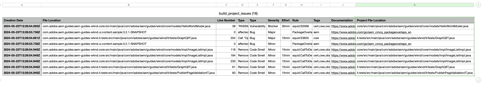

# Hantera pipelines {#managing-pipelines}

Lär dig hur du hanterar dina befintliga rörledningar, inklusive redigering, körning och borttagning av dem.

## Pipeline-kort {#pipeline-card}

Kortet **Pipelines** på sidan **Programöversikt** i Cloud Manager ger dig en översikt över alla dina pipelines och deras aktuella status.

Genom att klicka på ellipsknappen bredvid varje pipeline kan du utföra följande åtgärder.

* [Kör pipeline](#running-pipelines)
* [Redigera pipeline](#editing-pipelines)
* [Ta bort pipeline](#deleting-pipelines)
* [Visa detaljer](#view-details)

Längst ned i listan med rörledningar finns allmänna alternativ.

* **Lägg till** - Om du vill [lägga till en ny produktionspipeline](/help/using/production-pipelines.md) eller [lägga till ny icke-produktionspipeline](/help/using/non-production-pipelines.md)
* **Visa alla** - Tar användaren till skärmen **Pipelines** för att visa alla pipelines i en mer detaljerad tabell
* **Åtkomst till repo-information** - Visar den information som krävs för åtkomst till Cloud Manager Git-databasen
* **Läs mer** - Navigerar till resurser för pipeline-dokumentation för CI/CD.

## Fönstret Pipelines {#pipelines}

I fönstret **Pipelines** visas en fullständig lista över alla pipelines för det valda programmet. Detta är användbart eftersom det ger mer omfattande information än vad som finns tillgängligt i [pipeline-kortet](#pipeline-card).

1. Logga in på Cloud Manager på [my.cloudmanager.adobe.com](https://my.cloudmanager.adobe.com/) och välj rätt organisation och program.

1. På sidan **Programöversikt** klickar du på fliken **Pipelines** för att växla till fönstret **Pipelines**.

1. Här visas en lista med alla pipelines för programmet och du kan starta och stoppa pipelinekörning på samma sätt som i **pipelines-kortet**.

Om du klickar på ikonen `i` visas information om den senaste eller aktuella körningen av pipelinen.

Om du klickar på **Visa information** visas [information om pipelinekörningen](#view-details).

## Aktivitetsfönster {#activity}

Fönstret **Aktiviteter** visar en fullständig lista över alla pipelines-körningar för det valda programmet.

1. Logga in på Cloud Manager på [my.cloudmanager.adobe.com](https://my.cloudmanager.adobe.com/) och välj rätt organisation och program.

1. På sidan **Programöversikt** klickar du på fliken **Aktivitet** för att växla till fönstret **Aktivitet** .

1. Här visas en lista över alla pipeline-körningar för programmet, inklusive aktuella och historiska körningar.

Om du klickar på ikonen `i` visas information om körningen av den valda pipeline-körningen.

Om du klickar på **Visa information** visas [information om pipelinekörningen](#view-details).

## Löpande rörledningar {#running-pipelines}

1. Logga in på Cloud Manager på [my.cloudmanager.adobe.com](https://my.cloudmanager.adobe.com/) och välj rätt organisation och program.

1. Navigera till kortet **Pipelines** på sidan **Programöversikt** och klicka på ellipsknappen bredvid den pipeline du kör. Välj **Kör** på menyn.

1. Pipeline-körningen börjar och anges av kolumnen **Status**.

Du kan se information om körningen genom att klicka på ellipsknappen igen och välja **[Visa information](#view-details)**.

Beroende på typen av pipeline kan du eventuellt avbryta körningen genom att klicka på ellipsknappen igen och välja **Avbryt**.

## Redigera rörledningar {#editing-pipelines}

1. Logga in på Cloud Manager på [my.cloudmanager.adobe.com](https://my.cloudmanager.adobe.com/) och välj rätt organisation och program.

1. Navigera till kortet **Pipelines** på sidan **Programöversikt** och klicka på ellipsknappen bredvid den pipeline du vill redigera och välj sedan **Redigera** på menyn.

1. Dialogrutan **Redigera produktionspipeline** eller **Redigera icke-produktionspipeline** visas. Du kan redigera samma information som du angav när du skapade pipelinen.

   * På följande sidor finns mer information om alla fält och konfigurationsalternativ som är tillgängliga för pipelines.
      * [Konfigurera produktionsförlopp](/help/using/production-pipelines.md)
      * [Konfigurera icke-produktionsförlopp](/help/using/non-production-pipelines.md)

1. Klicka på **Uppdatera** när du är klar med redigeringen av pipeline.

>[!NOTE]
>
>Du kan inte redigera en pågående pipeline.

## Tar bort pipelines {#deleting-pipelines}

1. Logga in på Cloud Manager på [my.cloudmanager.adobe.com](https://my.cloudmanager.adobe.com/) och välj rätt organisation och program.

1. Navigera till kortet **Pipelines** på sidan **Programöversikt** och klicka på ellipsknappen bredvid den pipeline du kör. Välj **Ta bort** på menyn.

>[!NOTE]
>
>Du kan inte ta bort en pågående pipeline.

## Visa detaljer {#view-details}

1. Logga in på Cloud Manager på [my.cloudmanager.adobe.com](https://my.cloudmanager.adobe.com/) och välj rätt organisation och program.

1. Navigera till kortet **Pipelines** på sidan **Programöversikt** och klicka på ellipsknappen bredvid pipelinen som du kör. Välj **Visa information** på menyn.

1. Du dirigeras till informationssidan för den aktuella pipelinen.

Här kan du se status för de olika stegen i pipeline och hämta byggloggar för diagnostik. Mer information finns i dokumentet [Koddistribution](/help/using/code-deployment.md).

Alla steg i en pipeline-körning visas med de som ännu inte har startats nedtonade. De färdiga stegen visar varaktigheten.

När ett pipeline-steg är klart visas en sammanfattning.

Klicka på länken **Visa information** för att visa avsnittet **Varaktighet**. Detta inbegriper den genomsnittliga rörledningens varaktighet på grundval av den historiska trenden för det programmet.

Om din pipeline innehöll ett **kodskanningssteg**, vilket gav upphov till problem, kan du klicka på knappen **Hämta detaljer** för att visa en lista över [kodkvalitetstester](/help/using/code-quality-testing.md) som inte godkänts.

Det finns en **projektfilsplats**-kolumn i CSV-filen som anger platsen för den felaktiga koden. Den här kolumnen är den projektrelativa sökvägen, medan kolumnen **Filplats** är Maven-genererad.

>[!NOTE]
>
>Du kan bara visa information om en pipeline som körs eller har körts minst en gång.
