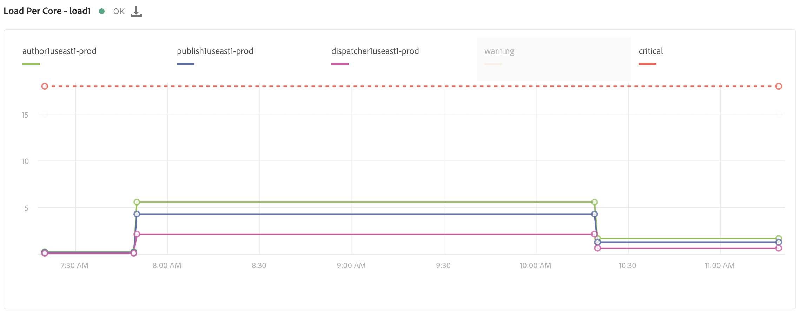

# Systemövervakning {#system-monitoring}

Systemövervakning i [!UICONTROL Cloud Manager] görs genom att observera de enskilda instanserna i en miljö och spåra en mängd mätvärden för varje instans. Varje mätvärde har två definierade tröskelvärden - ett *varningströskelvärde* och ett *kritiskt tröskelvärde*.

Om ett mätvärde överstiger dess kritiska tröskelvärde anses det befinna sig i ett kritiskt tillstånd. om ett mätvärde överstiger varningströskeln (men under det kritiska tröskelvärdet) anses det vara i ett varningstillstånd. Tröskelvärdena anges av Adobes hanterade tjänster och kan visualiseras i [!UICONTROL Cloud Manager]. I de flesta fall är tröskelvärdena olika för olika kunder, men det finns fall där Adobes hanterade tjänster ändrar tröskelvärdena så att de matchar specifika kundkrav. Frågor om tröskelvärdena ska ställas till din Customer Success Engineer (CSE).

## Navigera till systemövervakning {#navigating-system-monitoring}

Du kan navigera till funktionen Systemövervakning på två sätt.

1. Logga in på startsidan för **Managed Services - Program**.

   

1. Klicka på den fjärde ikonen på programkortet.

   

   *Eller*,

* Navigera till landningssidan **Systemövervakning** via det globala menyalternativet **Rapporter** i [!UICONTROL Cloud Manager].

## Översikt över systemövervakning {#system-monitoring-overview-page}

På sidan Systemövervakningsöversikt visas de övervakade miljöerna i programmet och rapporter om deras hälsa på hög nivå i fyra olika kategorier:

* **Värd**
* **Lagring**
* **Nätverk**
* **Program**

Statusen i varje kategori är en sammanfattning av enskilda mätvärden - om något mätvärde i en kategori är i kritiskt läge är hela kategorin i ett kritiskt tillstånd för syftet med översiktssidan. Samma sammanfattning kan visas på miljönivå och instansnivå.

>[!NOTE]
>
>Som standard visas instanser av produktionsmiljön när du navigerar till den här sidan, men även andra miljöer kan öppnas.

## Videosjälvstudiekurs {#video-tutorial}

### Översikt över Cloud Manager-rapporter {#reports-video}

Cloud Manager-rapporter ger en inblick i programmets miljöer och AEM genom en uppsättning diagram som rapporterar och håller reda på en mängd mätvärden för varje AEM.
Se videon nedan för mer information.

>[!VIDEO](https://video.tv.adobe.com/v/26315/)

## Systemövervakningsinformation {#system-monitoring-detail}

Om du vill visa information om specifika mått kan du antingen klicka på en av kategorierna i den vänstra navigeringen eller klicka på en av kategoriindikatorerna för en viss instans. På varje detaljsida visas en serie diagram för måtten i den kategorin. Du kan antingen visa mätvärden för alla instanser i en miljö eller för en viss instans. Du kan växla mellan miljö och instanser med listrutorna i det övre högra hörnet.

Navigeringen till vänster visar tillgängliga mätvärden i den valda kategorin som det finns data för den valda miljön och instanser för.

Ett enskilt diagram visar status och ett diagram över data över tiden tillsammans med tröskelvärdena. Om flera instanser visas kommer varje instans data att finnas i en separat serie.

Du kan dölja enskilda serier i ett diagram genom att klicka på serien i teckenförklaringen.
Om du till exempel klickar på varningströskelserien visas bara det kritiska tröskelvärdet.

### Måttdefinitioner {#metric-definitions}

**Värd**

* Belastning per kärna: Antalet processer som körs av CPU:n eller som befinner sig i vänteläge är i genomsnitt över en (load1), fem (load5) och femton (load15) minuter.
* Antal processer: antalet öppna processer.
* Antal användare: antalet användare med en aktiv gränssnittssession.
* Minnesanvändning: den procentandel systemminne som för närvarande allokeras.
* JVM-minne (heap): storleken (i megabyte) på den allokerade Java-heapen.
* Gammalt generationsutrymme: den procentandel av JVM-minne för gammal generering som för närvarande allokeras.

**Nätverk**

* CQ-portkontroll: Svarstiden i sekunder för åtkomst till AEM- eller Dispatcher-porten. Det finns olika mätvärden för författare, publicering och skickare.

**Lagring**

* Diskutrymme: Det använda diskutrymmet (i megabyte) för varje monteringspunkt på värden. Det finns olika mätvärden för varje monteringspunkt. Du kommer att se måtten för&quot;/&quot; och&quot;/mnt&quot;, men det kan finnas ytterligare monteringspunktsmått beroende på den specifika instanskonfigurationen.
* Mappstorlek: AEM segmentarkiv: Det diskutrymme som används (i Gigabyte) för AEM segmentlager.

**Program**

* Replikeringsagent: Tiden, i sekunder, för en testreplikeringshändelse. Det finns olika mått för varje replikeringsagent.
* Dispatcher Flush: Antalet objekt som för närvarande finns i dispatcherns tömningskö.

## SLA-rapportering {#sla-reporting}

Kunderna kan se hur väl deras AEM presterar jämfört med deras avtalade serviceavtal (SLA). Det här är tillgängligt via en undermeny på skärmen Rapporter.
I diagrammet nedan visas månatlig SLA-måltid för 2018.

Precis som med diagram för systemövervakning visar en rullande datapunkt de specifika värdena för den månaden.

Händelseanalysavsnittet under det här diagrammet visar den uppsättning incidenter som har inträffat för programmet under det valda året. Varje incident har ett tidsintervall, en orsak och en uppsättning kommentarer.

## SLA-mått {#sla-metrics}

* **Författarkontrakt**: Det här är det SLA som definieras i ditt avtal med Adobe Managed Services för författarnivån.

* **AMS Author SLA**: Detta är den uppmätta drifttiden för produktionsförfattarens nivåfactoringincidenter som orsakas av Adobe eller våra leverantörer.

* **Författar-SLA**: Det här är den uppmätta drifttiden för författarskiktet och ignorerar schemalagda driftavbrott, t.ex. underhållsperioder.

* **Slutanvändarkontrakt**: Det här är det SLA som definieras i ditt avtal med Adobes hanterade tjänster för publiceringsnivån.

* **AMS-slutanvändaravtal**: Detta är den uppmätta drifttiden för produktionsnivåfaktoriseringsincidenter som orsakas av Adobe eller våra leverantörer.

* **SLA för slutanvändare**: Detta är den uppmätta drifttiden för publiceringsskiktet som ignorerar schemalagda driftavbrott, t.ex. underhållsperioder.