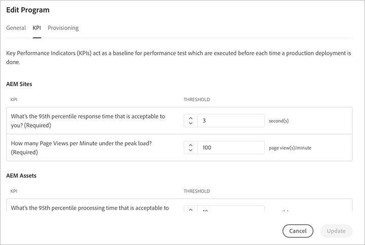

# Konfigurera ditt program {#setup-your-program}

Efter introduktionen måste företagsägaren slutföra en inledande konfiguration av programmet. Detta innebär att du ställer in programbeskrivningen och definierar de KPI:er (Key Performance Indicators) som ska användas för prestandatestning. Du kan också överföra en miniatyrbild. Dessutom kan företagsägaren konfigurera miljöetablering medan programmet konfigureras.

De KPI:er som definieras fungerar som en baslinje för prestandatestning som skickas varje gång pipeline körs.

>[!NOTE]
>De nyckeltal som definieras mäts vid provningar som körs på **stage** miljö. Vanligtvis skalas dessa KPI:er ned så att de passar scenmiljöns funktioner.
>En användare förväntar sig till exempel i genomsnitt 1 000 sidvisningar per minut i sin produktion **Miljö** och att ha fyra dispatcher-/publiceringsservrar i produktion bör skala detta till 250 sidvisningar per minut (om deras scenmiljö bara består av ett enda dispatcher-/publiceringsserverpar).
>Dessutom har många användare ett CDN (Content Delivery Network), till exempel Akamai eller CloudFront, framför produktionsmiljön. Sedan [!UICONTROL Cloud Manager] testning direkt mot scenmiljön bör KPI endast återspegla den trafik som förväntas passera genom CDN, det vill säga cacheminnet missar. Vanligtvis är detta en relativt liten del av den totala produktionstrafiken.

## Använda [!UICONTROL Cloud Manager] för att installera ditt program {#using-cloud-manager-to-setup-your-program}

Följ stegen nedan för att konfigurera programmet och definiera nyckeltal:

1. Klicka **Installationsprogram** för att starta installationsprocessen i [!UICONTROL Cloud Manager].

   

   >[!NOTE]
   > Du kan alltid växla, redigera eller lägga till ett nytt program från åtgärdsfältet enligt bilden nedan.

   

1. The **Installationsprogram** visas i fönstret Redigera programinformation.

1. Du kommer att se tre alternativ som **Allmänt**, **KPI** och **Provisionering** -fliken.

1. I **Allmänt** överför en miniatyrbild till programmet. Du kan också lägga till en beskrivning till programmet.

   

1. Under **KPI** kan du definiera två nyckeltal (förväntningarna för varje distribution). Separata KPI:er definieras för **AEM Sites** och **AEM Assets**. Du kan ange nyckeltal för de produkter som du har licensierat.

   **AEM Sites**

   1. Hur lång är den 95:e percentilens svarstid som du kan acceptera?

      * Rekommenderat värde - 3 sekunder
   1. Hur många sidvisningar per minut under toppbelastningen?

      * Rekommenderat värde - 200 sidvisningar per minut

   **AEM Assets**

   Sedan den första versionen har Cloud Manager kunnat utföra prestandatestning för AEM Sites-program. I den här versionen har funktionen även lagts till för att utföra prestandatester för AEM Assets-program. Resursprestandatestning utförs genom att resurser laddas upp upprepade gånger under en 30-minuters testperiod och att bearbetningstiden för varje tillgång samt olika mätvärden på systemnivå mäts.
Under programinstallationen anges resursspecifika nyckeltal:

   * 95:e percentilens bearbetningstid
   * Överförda resurser per minut

   

1. Under **Provisionering** kan du visa eller redigera provisioneringskonfigurationen för produktions- och icke-produktionsmiljöer i programmet. Du kommer att se **Automatisk skalning är aktiverat**, om autoskalning har aktiverats för programmet.

   >[!NOTE]
   >Funktionen för autoskalning kan bara användas i produktionsmiljön och kanske inte är tillgänglig för alla kundprogram.

   

1. Klicka **Spara** för att slutföra installationsguiden.

   >[!NOTE]
   >Du kan alltid redigera programmet när det initiala programmet redan har konfigurerats. Följ stegen nedan för mer information.

## Redigera ett program {#editing-program}

1. Navigera till programmet från **Cloud Manager** hemskärmen.

1. Klicka på **Redigera program** för att uppdatera eller ändra programmet från **Översikt** som i bilden nedan.

   

1. The **Redigera program** skärmar där du kan uppdatera eller ändra programmet.

   Du kan uppdatera programbeskrivningen från **Allmänt** -fliken.

   

   Navigera till **KPI** för att uppdatera information om AEM Sites och Assets.

   

   Dessutom kan du navigera till **Provisionering** för att redigera provisioneringskonfigurationen för produktions- och icke-produktionsmiljöer i ditt program.

   

1. Klicka på **Uppdatera** för att spara redigeringarna.

## Nästa steg {#the-next-steps}

Om du redan har konfigurerat pipeline kommer de uppdaterade inställningarna att beaktas vid nästa körning. Om du inte har konfigurerat pipeline än följer du stegen för att konfigurera din pipeline först.

Se dokumenten [Konfigurera produktionsförlopp](configuring-production-pipelines.md) och [Konfigurera icke-produktionsförlopp](configuring-non-production-pipelines.md) för att ställa in rörledningen.
