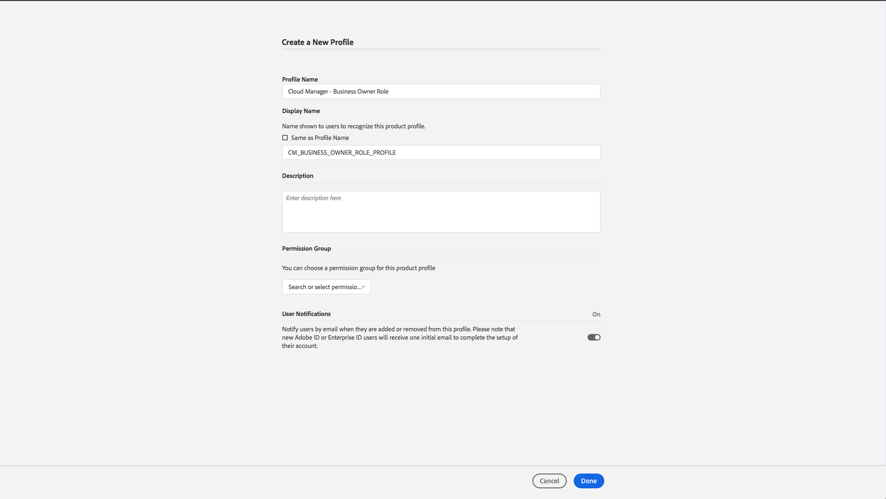

# Lägg till användare och roller {#add-users-and-roles}

Många funktioner i [!UICONTROL Cloud Manager] kräver specifika behörigheter för att kunna användas. Exempelvis kan bara vissa användare ange KPI:er (Key Performance Indicators) för ett program. Dessa behörigheter är logiskt grupperade i roller.

[!UICONTROL Cloud Manager] definierar för närvarande fyra roller för användare som styr tillgängligheten av specifika funktioner:

* Business Owner
* Program Manager
* Deployment Manager
* Developer

>[!CAUTION]
>
>Om du vill använda [!UICONTROL Cloud Manager] måste du ha en Adobe ID och produktkontexten för Adobes hanterade tjänster.

## Rolldefinitioner {#role-definitions}

>[!NOTE]
>
>Utvecklarrollen i Admin Console är inte relaterad till utvecklarrollen i [!UICONTROL Cloud Manager].

I följande tabell sammanfattas rollerna:

| [!UICONTROL Cloud Manager] Roller | Beskrivning |
|--- |--- |
| Företagsägare | Ansvarig för att definiera KPI:er, godkänna produktionsdistributioner och åsidosätta viktiga 3-skiktsfel. |
| Programhanteraren | Använder [!UICONTROL Cloud Manager] för att utföra gruppkonfiguration, granska status och visa KPI:er. Kan godkänna viktiga fel i tre nivåer. |
| Distributionshanteraren | Hanterar distributionsåtgärder. Använder [!UICONTROL Cloud Manager] för att köra scen-/produktionsdistributioner. Kan redigera CI/CD-rör. Kan godkänna viktiga fel i tre nivåer. Kan få åtkomst till Git-databasen. |
| Utvecklare | Utvecklar och testar anpassad programkod. I används främst [!UICONTROL Cloud Manager] för att visa status. Kan få åtkomst till Git-databasen för kodimplementering. |
| Customer Success Engineer | Stöder vanligtvis kundframgångar för AMS-kunder. Interagerar med [!UICONTROL Cloud Manager] för att köra distributioner som kräver CSE-övervakning. |
| Innehållsförfattare | I allmänhet interagerar inte med [!UICONTROL Cloud Manager]. Använd [!UICONTROL Cloud Manager] Programväljaren (när du har navigerat från [!UICONTROL Experience Cloud]) för att få åtkomst till AEM. |

## Skapa en profil {#using-admin-console-to-create-a-profile} med Admin Console

Roller hanteras för [!UICONTROL Cloud Manager] från Adobe Admin Console. Specifika rollmedlemskap erbjuds genom att användaren läggs till i en [!UICONTROL Cloud Manager]-produktprofil i Admin Console.

Du kan tilldela specifika rollmedlemskap genom att lägga till användaren i en **produktprofil** för [!UICONTROL Cloud Manager] i Adobe Admin Console, en central plats där du kan hantera Adobe-behörigheter för hela organisationen. Mer information om Adobe Admin Console finns i dokumentationen för [Admin Console](https://helpx.adobe.com/enterprise/using/admin-console.html).

>[!NOTE]
>
>Öppna en webbläsare och gå till Admin Console och konfigurera ditt team (användare och roller) och gå till [https://adminconsole.adobe.com](https://adminconsole.adobe.com/enterprise).

För att kunna ge [!UICONTROL Cloud Manager]-användarna rätt rollbaserade behörigheter måste en administratör i kundens **organisation** skapa nya produktprofiler för [!UICONTROL AEM Managed Services].

För att ge rätt rollbaserade behörigheter till [!UICONTROL Cloud Manager]-användare måste du som administratör skapa fyra nya produktprofiler under [!UICONTROL AEM Managed Services] produktkontext som motsvarar var och en av de fyra [!UICONTROL Cloud Manager]-rollerna:

* Företagsägare
* Distributionshanteraren
* Utvecklare
* Programhanteraren

Du kan skapa eller lägga till användare/grupper i dessa produktprofiler med [Admin Console](https://adminconsole.adobe.com/) för [!UICONTROL Cloud Manager], vilket visas i bilden nedan:

1. Logga in på Admin Console och klicka på **Ny profil** för att lägga till en ny profil.

   

1. Fyll i fälten för att konfigurera en ny roll för [!UICONTROL Cloud Manager].

   Ange **profilnamn**, **visningsnamn** för att skapa en ny profil. Dessutom kan du välja en **behörighetsgrupp** för profilen.

   Klicka på **Klar** för att slutföra steget när du skapar profilen.

   >[!NOTE]
   >
   >När du skapar de här produktprofilerna måste **visningsnamnet** vara det tekniska värde som definieras av [!UICONTROL Cloud Manager] (se tabellen nedan). **Profilnamnet** kan vara vad som helst, men för att undvika missförstånd bör du använda värdena i kolumnen *Rekommenderat profilnamn* nedan. När du skapar produktprofilen avmarkerar du **Samma som profilnamn** och anger motsvarande värde som **visningsnamn**.

   | **Roll** | **Visningsnamn (obligatoriskt)** | **Rekommenderat profilnamn** |
   |---|---|---|
   | Företagsägare | CM_BUSINESS_OWNER_ROLE_PROFILE | [!UICONTROL Cloud Manager] - Roll för företagsägare |
   | Distributionshanteraren | CM_DEPLOYMENT_MANAGER_ROLE_PROFILE | [!UICONTROL Cloud Manager] - Distributionshanterarroll |
   | Utvecklare | CM_DEVELOPER_ROLE_PROFILE | [!UICONTROL Cloud Manager] - Utvecklarroll |
   | Programhanteraren | CM_PROGRAM_MANAGER_ROLE_PROFILE | [!UICONTROL Cloud Manager] - Programhanterarroll |

   

1. När du har skapat en produktprofil kan du lägga till användare (eller grupper) i dessa produktprofiler.

   

   

