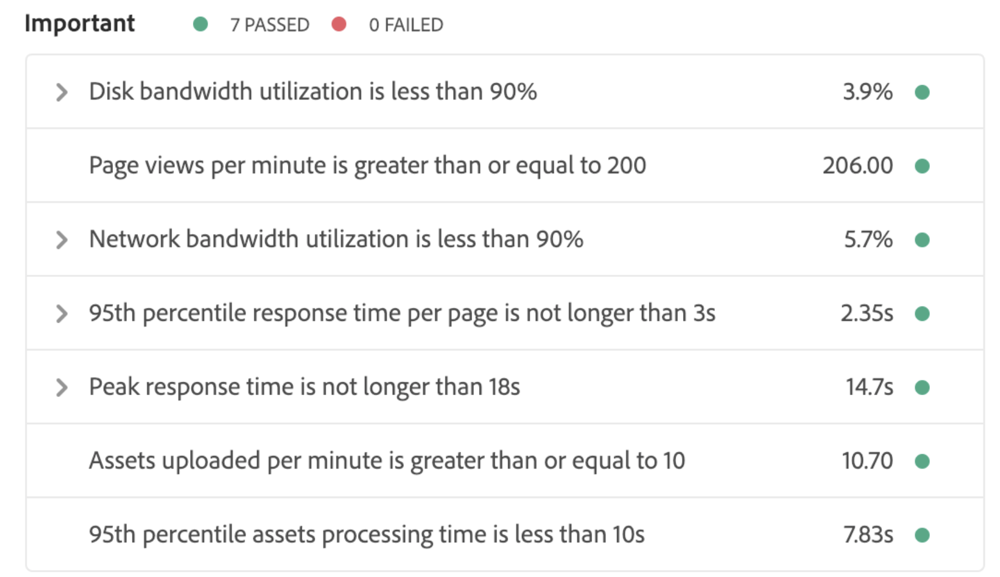

# Förstå testresultat {#understand-your-test-results}

Under **pipeline** -processen hämtas och jämförs ett antal mätvärden med nyckeltal (KPI) som definieras av företagsägaren, eller standarder som anges av Adobe Managed Services.

Dessa rapporteras med hjälp av ett system med tre nivåer av klassificering enligt definitionen i detta avsnitt.

## Tre nivåportar under körning av en pipeline  {#three-tier-gates-while-running-a-pipeline}

Det finns tre portar i pipeline:

* Kodkvalitet
* Prestandatestning
* Säkerhetstestning

För var och en av dessa portar finns det en struktur på tre nivåer för problem som identifieras av porten.

* **Kritiskt** - Detta är problem som identifieras av porten och som orsakar ett omedelbart fel i rörledningen.
* **Viktigt** - Det här är problem som identifieras av porten och som gör att pipelinen försätts i pausläge. Distributionshanteraren, projektledaren eller företagsägaren kan antingen åsidosätta problemen, i vilket fall pipeline fortsätter, eller så kan de acceptera problemen. I så fall upphör pipeline med ett fel.
* **Info** - Detta är frågor som identifieras av portalen och som endast tillhandahålls i informationssyfte och som inte har någon inverkan på ledningen.

>[!NOTE]
>
>I en pipeline med enbart kodkvalitet kan viktiga fel i porten för testning av kodkvalitet inte åsidosättas eftersom steget Testning av kodkvalitet är det sista steget i pipeline.

## Testning av kodkvalitet {#code-quality-testing}

Som en del av pipeline skannas källkoden för att säkerställa att distributionerna uppfyller vissa kvalitetskriterier. För närvarande implementeras detta genom en kombination av SonarQube och granskning på innehållspaketnivå med hjälp av OakPAL. Det finns över 100 regler som kombinerar allmänna Java-regler och AEM-specifika regler. I följande tabell sammanfattas klassificeringen för testkriterier:

| Namn | Definition | Kategori | Feltröskel |
|--- |--- |--- |--- |
| Säkerhetsklassificering | A = 0 Sårbarhet <br/>B = minst 1 Mindre sårbarhet<br/> C = minst 1 Större sårbarhet <br/>D = minst 1 Kritisk sårbarhet <br/>E = minst 1 Blockerare Sårbarhet | Kritisk | &lt; B |
| Tillförlitlighetsklassificering | A = 0 Fel <br/>B = minst 1 mindre fel <br/>C = minst 1 större fel <br/>D = minst 1 allvarligt fel E = minst 1 blockeringsfel | Viktigt | &lt; C |
| Underhållbarhetsklassificering | Oöverträffade reparationskostnader för illaluktande kod är: <br/><ul><li>&lt;=5 % av tiden som redan har gått in i programmet är klassificeringen A </li><li>Betyg 6-10 % är B </li><li>Betyg mellan 11 och 20 % är ett C </li><li>Betyg mellan 21 och 50 % är ett D</li><li>över 50 % är ett E</li></ul> | Viktigt | &lt; A |
| Täckning | En blandning av radens disponering och villkorstäckning med denna formel: <br/>`Coverage = (CT + CF + LC)/(2*B + EL)`  <br/>där: CT = villkor som har utvärderats till &#39;true&#39; minst en gång under enhetstester <br/>CF = villkor som har utvärderats till &#39;false&#39; minst en gång under enhetstester <br/>LC = täckta linjer = lines_to_cover - uncover_lines <br/><br/> B = totalt antal villkor <br/>EL = totalt antal körbara rader (lines_to_cover) | Viktigt | &lt; 50% |
| Överhoppade enhetstester | Antal överhoppade enhetstester. | Information | > 1 |
| Öppna ärenden | Generella problemtyper - sårbarheter, fel och kodmellanslag | Information | > 1 |
| Duplicerade rader | Antal rader som ingår i duplicerade block. <br/>För att ett kodblock ska betraktas som duplicerat: <br/><ul><li>**Projekt som inte är Java:**</li><li>Det ska finnas minst 100 efterföljande och duplicerade tokens.</li><li>Dessa tokens bör spridas åtminstone på: </li><li>30 kodrader för COBOL </li><li>20 kodrader för ABAP </li><li>10 kodrader för andra språk</li><li>**Java-projekt:**</li><li> Det ska finnas minst 10 efterföljande och duplicerade satser oavsett antalet tokens och rader.</li></ul> <br/>Skillnader i indrag och i stränglitteraler ignoreras när dubbletter identifieras. | Information | > 1% |
| Kompatibilitet med molntjänster | Antal identifierade kompatibilitetsproblem med molntjänster. | Information | >0 |


>[!NOTE]
>
>Mer detaljerade definitioner finns i [Måttdefinitioner](https://docs.sonarqube.org/display/SONAR/Metric+Definitions) .

Du kan hämta listan med regler här [code-quality-rules.xlsx](/help/using/assets/CodeQuality-rules-latest.xlsx)

>[!NOTE]
>
>Mer information om de anpassade regler för kodkvalitet som körs av [!UICONTROL Cloud Manager]finns i [Anpassade regler](custom-code-quality-rules.md)för kodkvalitet.

### Hantera med falskt positiva {#dealing-with-false-positives}

Kvalitetsskanningsprocessen är inte perfekt och kan ibland felaktigt identifiera problem som inte är problematiska. Detta kallas &quot;falskt positivt&quot;.

I dessa fall kan källkoden kommenteras med Java- `@SuppressWarnings` standardanteckningen som anger regel-ID som anteckningsattribut. Ett vanligt problem är att regeln SonarQube för att identifiera hårdkodade lösenord kan vara aggressiv om hur ett hårdkodat lösenord identifieras.

Om du vill titta på ett specifikt exempel är koden ganska vanlig i ett AEM-projekt som har kod för att ansluta till en extern tjänst:

```java
@Property(label = "Service Password")
private static final String PROP_SERVICE_PASSWORD = "password";
```

SonarQube kommer då att öka en blockerbarhets - sårbarhet. När du har granskat koden identifierar du att detta inte är en sårbarhet och kan kommentera detta med rätt regel-ID.

```java
@SuppressWarnings("squid:S2068")
@Property(label = "Service Password")
private static final String PROP_SERVICE_PASSWORD = "password";
```

Om koden i själva verket var så här:

```java
@Property(label = "Service Password", value = "mysecretpassword")
private static final String PROP_SERVICE_PASSWORD = "password";
```

Den rätta lösningen är sedan att ta bort det hårdkodade lösenordet.

>[!NOTE]
>
>Även om det är en god vana att göra anteckningen så specifik som möjligt, dvs. bara anteckna den specifika programsats eller det block som orsakar problemet, är det möjligt att anteckna på klassnivå. `@SuppressWarnings`

## Säkerhetstestning {#security-testing}

[!UICONTROL Cloud Manager] kör de befintliga ***AEM Security Heath Checks*** på scenen efter distributionen och rapporterar statusen via användargränssnittet. Resultaten sammanställs från alla AEM-instanser i miljön.

Om någon av **instanserna** rapporterar ett fel för en viss hälsokontroll misslyckas hälsokontrollen i hela **miljön** . Precis som för kodkvalitets- och prestandatestning är dessa hälsokontroller ordnade i kategorier och rapporterade med hjälp av ett system med tre nivåer. Den enda skillnaden är att det inte finns något tröskelvärde när det gäller säkerhetstestning. Alla hälsokontroller godkänns eller misslyckas helt enkelt.

I följande tabell visas de aktuella kontrollerna:

| **Namn** | **Implementering av hälsokontroll** | **Kategori** |
|---|---|---|
| Brandväggsberedskap för Attach API för deserialisering är i ett godtagbart tillstånd | Brandväggsberedskap för koppling av deserialisering till API | Kritisk |
| Brandväggen för deserialisering fungerar | Brandvägg för deserialisering | Kritisk |
| Brandväggen för deserialisering har lästs in | Brandvägg för deserialisering har lästs in | Kritisk |
| AuthorizableNodeName-implementeringen visar inte auktoriseringsbart ID i nodens namn/sökväg. | Generering av auktoriseringsbart nodnamn | Kritisk |
| Standardlösenord har ändrats | Standardinloggningskonton | Kritisk |
| GET-standardservern för Sling är skyddad från DOS-attacker. | Sling Get Servlet | Kritisk |
| Hanteraren för Sling-Java-skript är korrekt konfigurerad | Sling Java Script Handler | Kritisk |
| Sling JSP Script Handler är korrekt konfigurerad | Sling JSP Script Handler | Kritisk |
| SSL är korrekt konfigurerat | SSL-konfiguration | Kritisk |
| Inga uppenbart osäkra profiler för användarprofiler hittades | Standardåtkomst för användarprofil | Kritisk |
| Sling Referrer-filtret är konfigurerat för att förhindra CSRF-attacker | Sling-referensfilter | Viktigt |
| Adobe Granite HTML Library Manager är korrekt konfigurerat | CQ HTML Library Manager Config | Viktigt |
| Supportpaketet för CRXDE är inaktiverat | Stöd för CRXDE | Viktigt |
| Sling DavEx-paket och -servlet är inaktiverade | DavEx-hälsokontroll | Viktigt |
| Exempelinnehåll är inte installerat | Exempel på innehållspaket | Viktigt |
| Både WCM-begärandefiltret och WCM-felsökningsfiltret är inaktiverade | Konfiguration av WCM-filter | Viktigt |
| Sling WebDAV-paket och -servlet har konfigurerats på rätt sätt | WebDAV-hälsokontroll | Viktigt |
| Webbservern är konfigurerad för att förhindra clickjacking | Konfiguration av webbserver | Viktigt |
| Replikeringen använder inte admin-användaren | Replikerings- och transportanvändare | Information |

## Prestandatestning {#performance-testing}

*Prestandatestning* i [!UICONTROL Cloud Manager] implementeras med 30 minuters test.

Under pipeline-konfigurationen kan driftsättningshanteraren bestämma hur mycket trafik som ska dirigeras till varje bucket.

Du kan läsa mer om bucket-kontroller i [Konfigurera CI/CD-pipeline](configuring-pipeline.md).

>[!NOTE]
>
>Information om hur du konfigurerar programmet och definierar nyckeltal finns i [Konfigurera programmet](setting-up-program.md).

I följande tabell sammanfattas prestandatestmatrisen med hjälp av ett system med tre nivåer:

| **Mått** | **Kategori** | **Feltröskel** |
|---|---|---|
| Felfrekvens för sidbegäran % | Kritisk | >= 2% |
| CPU-utnyttjandegrad | Kritisk | >= 80% |
| Väntetid för disk-I/O | Kritisk | >= 50% |
| 95 % svarstid | Viktigt | >= KPI på programnivå |
| Tid för högsta svar | Viktigt | >= 18 sekunder |
| Sidvyer per minut | Viktigt | &lt; KPI på programnivå |
| Användning av diskbandbredd | Viktigt | >= 90% |
| Utnyttjande av nätverksbandbredd | Viktigt | >= 90% |
| Begäranden per minut | Information | &lt; 6000 |

### Resultatdiagram för prestandatestning {#performance-testing-results-graphs}

Nya diagram och nedladdningsalternativ har lagts till i dialogrutan Resultat av prestandatestning.

När du öppnar dialogrutan Prestandatest kan du expandera mätpanelerna för att visa ett diagram, skapa en länk till en hämtning eller båda.

I version 2018.7.0 [!UICONTROL Cloud Manager] är den här funktionen tillgänglig för följande mått:

* **CPU-användning**
   * En graf över CPU-användningen under testperioden.

* **Diskens I/O-väntetid**
   * Ett diagram över disk-I/O-väntetiden under testperioden.

* **Felfrekvens för sida**
   * Ett diagram över sidfel per minut under testperioden.
   * En CSV-fil med en lista över sidor som har orsakat ett fel under testet.

* **Användning av diskbandbredd**
   * Ett diagram över användning av diskbandbredd under testperioden.

* **Utnyttjande av nätverksbandbredd**
   * Ett diagram över användning av nätverksbandbredd under testperioden.

* **Tid för högsta svar**
   * En graf över maximal svarstid per minut under testperioden.

* **95:e procentig svarstid**
   * Ett diagram över 95:e percentilens svarstid per minut under testperioden.
   * En CSV-fil med en lista över sidor vars 95:e percentilsvarstid har överskridit den definierade KPI:n.

I följande bilder visas prestandatestdiagrammen:




